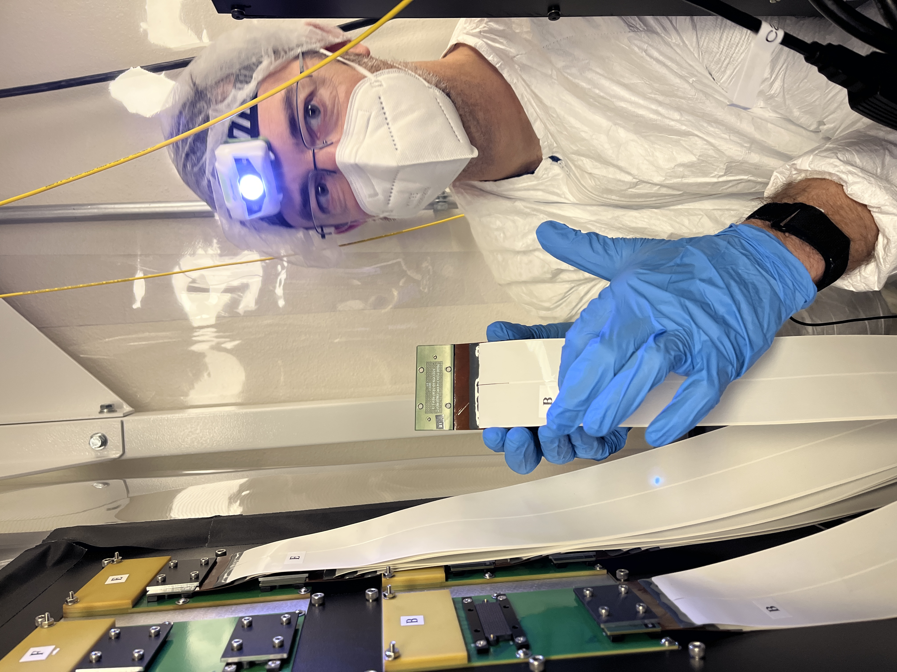
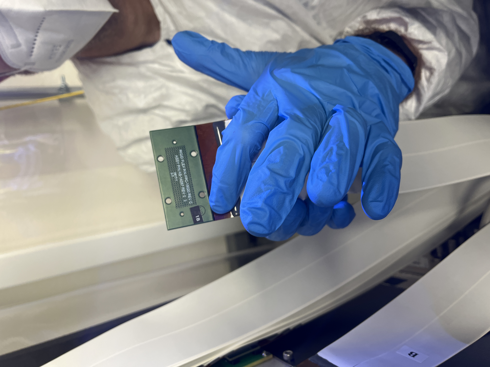
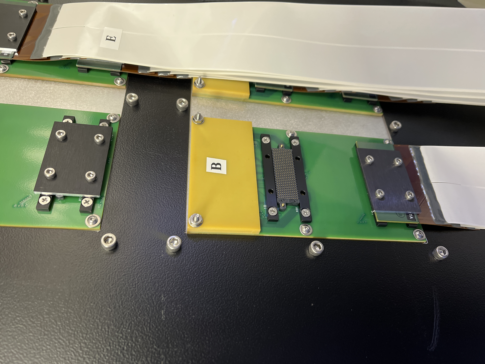

MEMS DM Cabling
=================================================================

Instructions for cabling and de-cabling the BMC MEMS deformable mirrors in MagAO-X.

Use gloves, hairnets, masks, and gowns in addition to the precautions below while handling the deformable mirror cables.

Preliminaries: ESD monitor
--------------------------

The ESD monitor must be connected to the system, to power, and to the personnel before any DM cabling can proceed.

1. Unpack ESD monitor from box. You should have:

    - 1 white plastic box with the ESD monitor electronics
    - 2 RJ11 "phone cords"
    - 2 black terminals with RJ11 jacks
    - 2 green banana-plug to spade connector grounding leads
    - 2 curly wrist strap leads with banana plugs (remove alligator clips if needed)
    - 2 wrist straps with buttons to attach the leads
    - 1 AC to DC power converter with black "headphone jack" plug

2. Connect: 

    1. RJ11 between black terminals and jacks on ESD monitor (**Note:** Missing/loose RJ11 connections do NOT trigger the 'grounding lost' alarm.)
    2. each curly wrist strap lead to a black terminal's yellow banana plug receptacle and to the button connection on the wrist strap (see image)
    
        .. image:: figures/esd_monitor_user_terminal.jpg
            :width: 50%
    
    3. The ground leads:

        - **If you have a grounding mat,** connect it to the jack labeled "MAT" on the plastic enclosure
        - **If you do not,** attach both ground and mat banana plugs to the plastic box, then screw both spade connectors to the main MagAO-X optical table with a 1/4"-20 bolt (uncoated / silvery preferred for conductivity)

3. Connect the power adapter to the wall outlet and the jack on the ESD monitor. If something is configured incorrectly, it will proceed to screech at you. If you have all green indicator lights, proceed. **If not, check all connections before proceeding.**
4. Test that the electronics rack is grounded to facility ground
5. Test that the table is at the same ground as the rack
6. Use multimeter to verify there's continuity between table and rack

Disconnecting BMC ribbon cables
-------------------------------

The BMC ribbon cables run from the DM in MagAO-X, through a strain relief clamp, to interface panels on the outside of the electronics rack. For shipment, they are bagged and coiled into a compartment on MagAO-X itself.

Required workers: 2 minimum, 3 preferred.

Required equipment:
    
    - ESD bags
    - scotch tape
    - hex drivers
    - bubble wrap
    - plate to cover the ribbon cable stowage cavity.
    - Cleanroom gown, cap, mask, gloves for each worker

**Are you grounded? Is your assistant grounded? Verify that unbuttoning the grounding strap lead causes the ESD monitor to alarm.**

For every lettered interface plate, repeat these steps, working from top to bottom on the MagAO-X side panel with an assistant.:

1. Loosen 4x captive hex cap head bolts securing the plate that sandwiches the ribbon cable to its connector
2. Remove plate and ribbon cable, taking care not to dislodge the springy contact array component (which remains on the interface panel

    .. image:: figures/bmc_post_disconnect_one.jpg
        :width: 50%

3. Set plate aside, have assistant bag the end of the ribbon cable with an ESD bag. Fold the excess ESD bag over to make it approximately the right width, and use tape to secure ESD bag to itself and to the ribbon cable.

    .. image:: figures/bmc_taped_esd_bag.jpg
        :width: 50%

4. Gently lower the bagged ribbon cable to hang down, avoiding kinks. It should not *reach* the floor, but don't let it touch the floor in any case.

    .. image:: figures/bmc_bagged_cables.jpg
        :width: 50%

5. Replace the interface plate on the panel and **hand-tighten** the bolts. (Over-tightening leads to bent pins, bad connections, and headaches.)

    .. image:: figures/rack_bmc_connection_plates.jpg
        :width: 50%

Once the cables are all disconnected from the electronics rack, there will be two clear sets of ribbon cables. Coil those corresponding to the left half (as viewed facing where they enter the instrument) and stow them in the bottom of the cavity. Apply a bubble wrap buffer. Coil the right half of the cables, insert those above the left half, and pack any remaining volume with additional bubble wrap.

Cover the connection plates on the electronics rack.

.. image:: figures/rack_connectors.jpg
    :width: 50%

Reconnecting BMC ribbon cables
------------------------------

Required workers: 2 minimum, 3 preferred.

Required equipment:

    - grounding system connected
    - hex drivers
    - small flathead screwdriver (to use as a pry-bar)
    - needle nose pliers (smaller the better, for stuck pin removal)
    - Cleanroom gown, cap, mask, gloves for each worker
    - clean N2 spray gun
    - Isopropyl
    - Acetone
    - Lint free wipes

**Are you grounded? Is your assistant grounded? Verify that unbuttoning the grounding strap lead causes the ESD monitor to alarm.**

The detailed procedure is described in section 3.2 of MagAO-X PSR Document :download:`2.2 Deformable Mirrors <../appendices/psr/2_2_Deformable_Mirrors.pdf>`.

One extra tip: each set of ribbon cables has a large and legible letter designation, and a much smaller letter/number/letter designation.

If you're holding a cable that says "E" on it, inspect the end of the cable to see whether it's E1A or E1B. The panel on the outside of the electronics rack will have a letter per pair of connectors, and a smaller silkscreened letter/number designation telling you which one is 1A and which is 1B. As explained in the PSR document, begin with the connection further from the yellow plate on each pair.

If a pin sticks, very carefully pull it out using needle nose pliers.  Do not drop it.  Insert it back into the removable connector in the same orientation.

If removable connector is stuck and can't be removed with fingers, very carefully use a small flathead screwdriver to pry it off from one side.  Do not allow the screw driver to touch any contacts.

Finish by checking actuator functionality, following `this notebook on the RTC <https://github.com/magao-x/magpyx/blob/master/notebooks/connection_doctor_example.ipynb>`_
