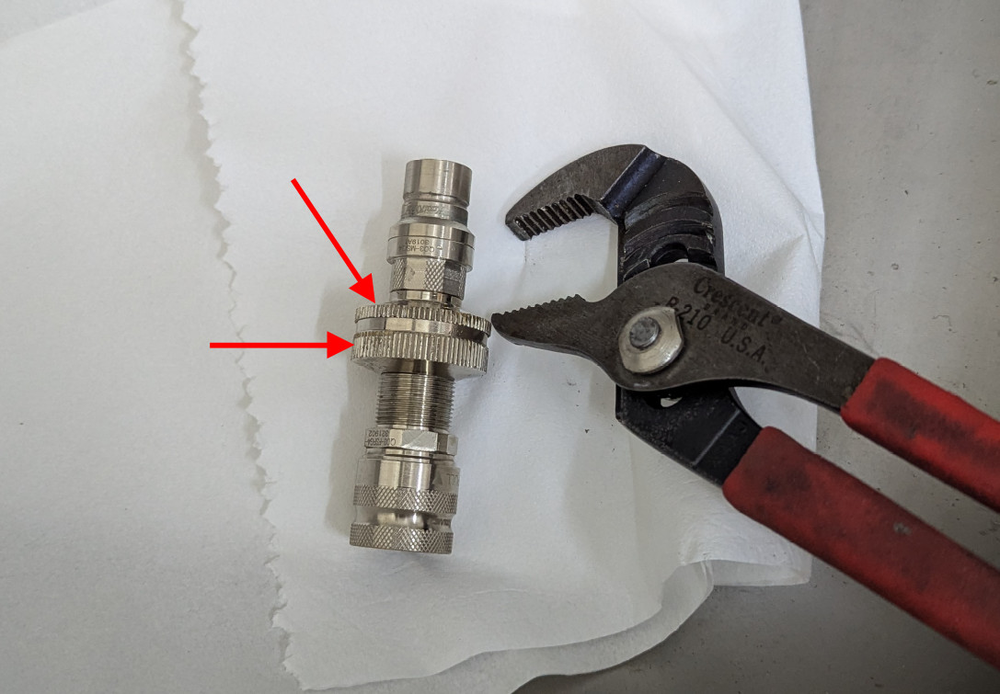
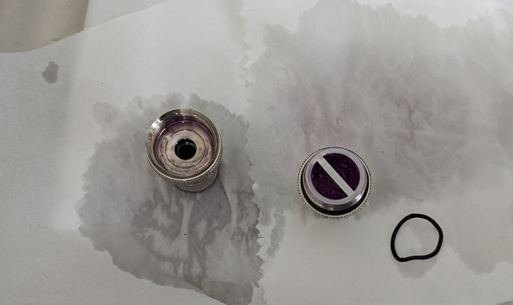
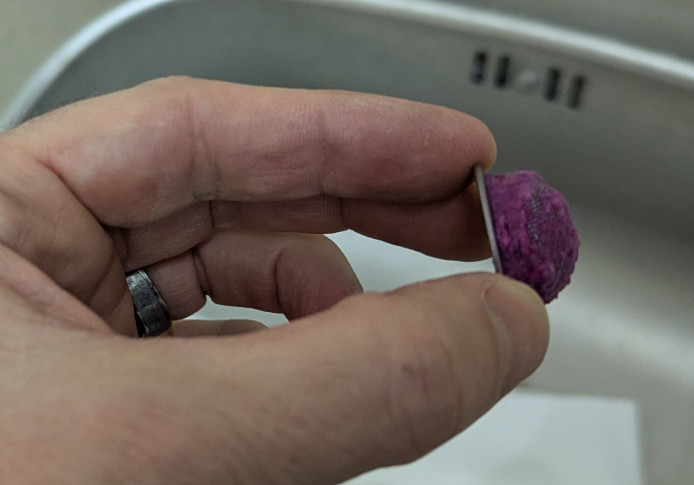
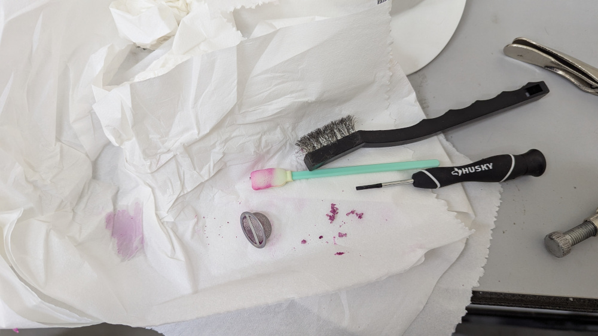

Coolant Filter Cleaning
=======================

The instrument cooling system has an inline filter which must be cleaned out periodically.

Indications
------------

The INDI property :prop:`instCool.status.flow_rate` shows the instrument cooling flow rate in liters per minute.  The pump speed
is shown in :prop:`instCool.pump_level.current`.

Coolant flow should be at or above 1.9 LPM under normal operating conditions.  With the cameras off and with minimal
computational loads it can fall below this due to the viscosity of cold glycol (especially at the telescope where it
is colder than Tucson).  If the system is under full load, the pump is on 10, and the sytem is in
thermal equilibrium, but flow is consistenly under 1.9 LPM the filter should be inspected and cleaned if necessary.
It should also be done routinely prior to a telescope run and every few months.

.. note::
    the 1.9 LPM specification is derived from the required flow rate for the OCAM 2K camera (:dev:`camwfs`).

Precautions
-----------

.. warning::
    Do not dump glycol down a sink drain or into the environment.

.. warning::
    All liquid cooled components must be off prior to turning off :dev:`instCool`

Procedure
----------

1. Required Tools

   - 2x goose neck pliers
   - paper towels
   - a small flat screwdriver
   - wire brush
   - q-tip
   - acetone [maybe]

2. Initial Conditions.

   - RTC, ICC, and liquid cooled cameras (camwfs, camsci1, camsci2) off.
   - instCool on

3. Remove the lower cover plate labeld "cooling access" on the input side of the electronics rack to
expose the cooler control panel.

   .. image:: figures/instCool_control_access.jpg

   *Instrument cooling control panel access*

4. Note coolant flow in :prop:`instCool.status.flow_rate` and on the cooler control panel.  As noted above this is somewhat
thermal-load dependent.

5. Power off :dev:`instCool` with the rocker switch.  Do this locally, as opposed to with **pwrGUI**, for later leak checks.

6. Remove the filter from the system using its quick disconnects.

   .. image:: figures/instCool_filter.jpg

   *Instrument cooling filter and quick disconnects.*

.. note::
     In the next step be sure to note the order of components inside the filter

.. warning::
     Take care to not damage the o-rings

7. Using 2x goose neck plier (or a vise grip in a bench) open the filter housing by unscrewing it.

*The red arrows indicate where the pliers grip to unscrew the filter housing.*

*After opening.  The o-ring shown goes between the filter basket and the inside of the housing.  The one shown is in need of replacement.*

8. Remove the filter, being careful with the o-ring

*The filter basket full of glycol gunk.*

9. Clean the filter

   - Use the wire brush to dislodge the crud
   - Scrape with the screw driver as need inside
   - Soak in acetone if needed to loosen the crud
   - Once clean, rinse the filter in water to remove acetone residue

*The filter basket after cleaning.*

10. Reassemble the filter, carefully threading it together and seating on the o-ring.

11. Tighten with the pliers.  Use full force, it should stop turning like it hit a hard stop.

12. Reinstall the filter.

13. Turn :dev:`instCool` back on with the rocker switch.

14. Check for leaks from the reinstalled filter (wait at least 10 minutes).

15. Note coolant flow, comparing to the pre-clean value noted above.

16. Reinstall the cover plate on the rack.

17. It is now ok to power up and do some wavefront control.

