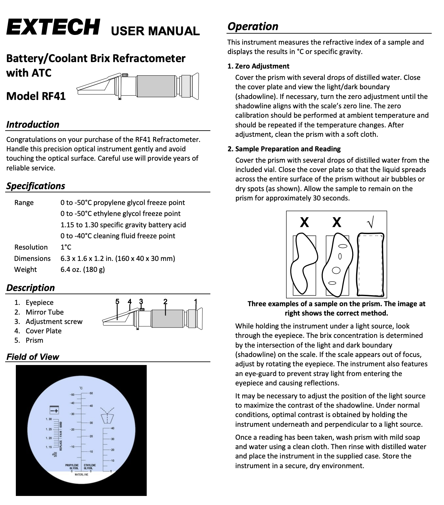
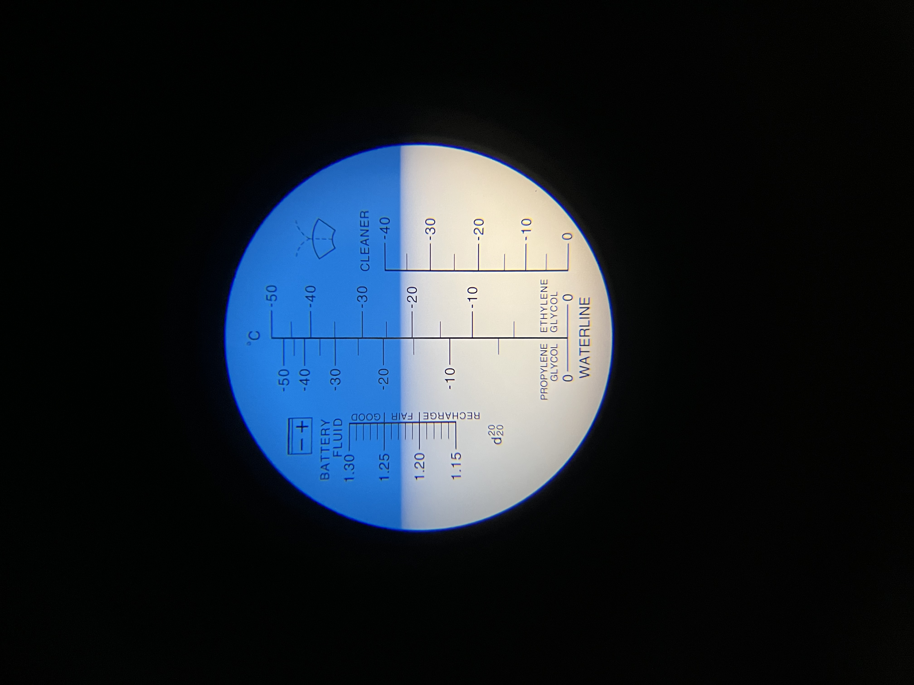

Using the refractometer to measure the freezing point of ethylene glycol
========================

The cleanroom at LCO stocks an Extech R41 model refractometer in the cabinet (might be in a toolbox). It is in a black semi-hardshell case about the size of an eyeglasses case.

Usage
----------

Latest measurement
----------

On 2026-03-21 we measured the MagAO-X instrument glycol concentration using the refractometer and found a freezing point of about -22 Celsius.

