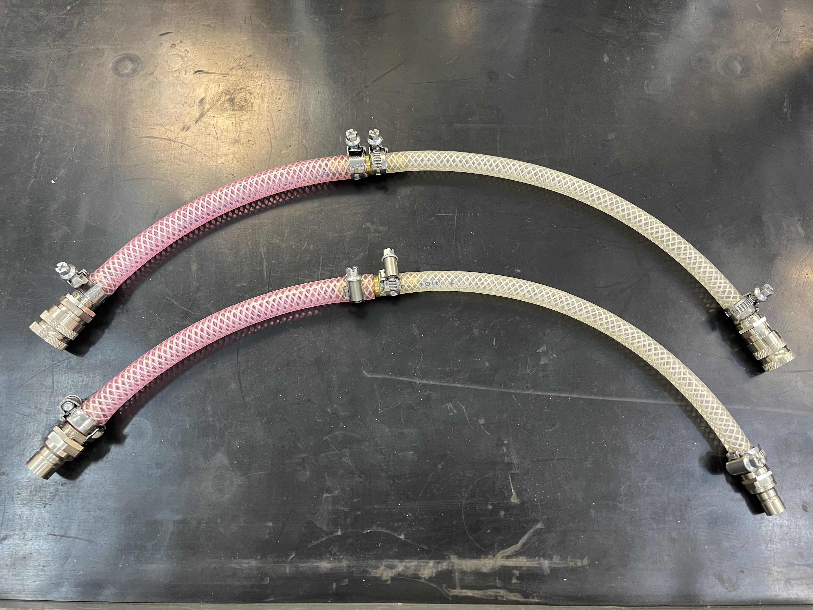
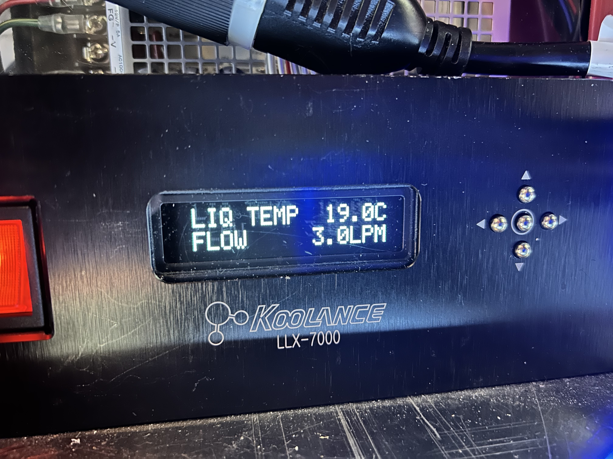

Coolant System Backflush
========================

After a period of time (months), the glycol-based cooling system accumulates the byproduct of some kind of organism,
maybe a type of slime mold, and the flow of glycol becomes restricted. This procedure should be done every 4-6 months
to prevent high GPU and/or high CPU temps.

The filter basket needs to be cleaned before starting this procedure.

  .. toctree::
   :maxdepth: 1

   filter_cleaning
  
Procedure
----------

1. Required Tools

   - 2x CPU backflush jigs
   - 2x GPU backflush jigs (smaller hose diam.)
   - paper towels
   - large flathead screwdriver (rack panel removal)

2. Initial Conditions.

   - RTC, ICC, and liquid cooled cameras (camwfs, camsci1, camsci2) off.
   - instCool on.
   - filter basket has been cleaned and reinstalled.

3. Disconnect the coolant hoses at the MagAO-X inlet and connect them together to form a closed loop. This is to maximize flow rate though the electronics rack.
  
4. Remove the large cover plate on the input side of the electronics rack
(opposite to MagAO-X) to expose the cooler control panel.

   .. image:: figures/cpu_gpu_cooling.jpeg

   *View after removing the large input side cover plate*

5. Note coolant flow in :prop:`instCool.status.flow_rate` and on the cooler control panel. Make note of the initial
   average flow rate to gauge progress during the backflush.

6. Power off :dev:`instCool` with the rocker switch.  Do this locally, as opposed to with **pwrGUI**, for later leak checks.

7. Locate the hoses connected to each device to be backflushed. The GPUs are plumbed in series, so they must be backflushed
   one-by-one to avoid pushing large masses into the restrictive heat exchangers on each GPU.

   .. image:: figures/inside_rack_hoses.jpeg

   *Example ICC CPU hose loop looking inside the rack from the front.*

  .. warning::
     The quick-disconnects are well-engineered and normally leak-proof, but protect the instrument computers with
     paper towels under the hoses for good measure.

8. Disconnect the two coolant hoses to one device and use the backflush jigs to reverse the flow of coolant
   to that specific device.

.. image:: figures/backflush_jigs_og.jpeg

*The jigs are composed of a male<->male and female<->female configuration for flow reversal.*

*The GPU hoses have a smaller diameter, so they require the jigs that feature a step down in connector size.*

9. Power on :dev:`instCool` with the rocker switch and let the coolant flow for ~2 minutes. Make notes on the flow rate with
   time. Power *OFF* :dev:`instCool`to lower cooling system pressure. 
   Remove the jigs and reconnect the rack coolant hoses to restore the nominal configuration. 

*Flow rate should improve after a minute or so of backflushing.*

10. Repeat steps 8 and 9 for each device that needs backflushing.

11. After backflushing, double check each hose connection for leaks when instCool is *ON*.

12. The filter basket needs to be cleaned after the backflushing procedure as per the guide.

.. toctree::
   :maxdepth: 1

   filter_cleaning

*The filter -will- be clogged after backflushing, ensure that it's clean before returning to normal ops.*

12. Finish up by reinstalling the input-side cover plate on the electronics rack and reconnecting the coolant hoses at the MagAO-X inlet.

Leak Check
----------

The job is done when instCool is powered back on and all external connections are showing no leaks.
