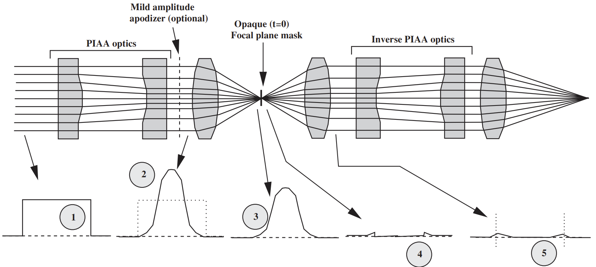
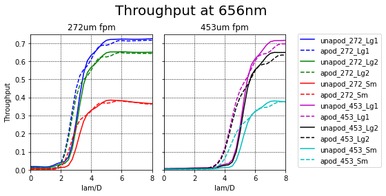
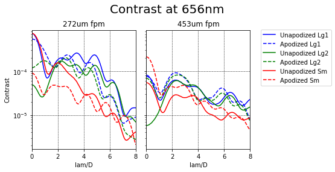
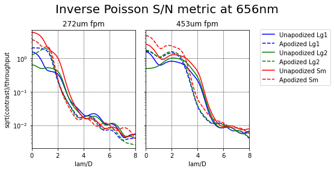
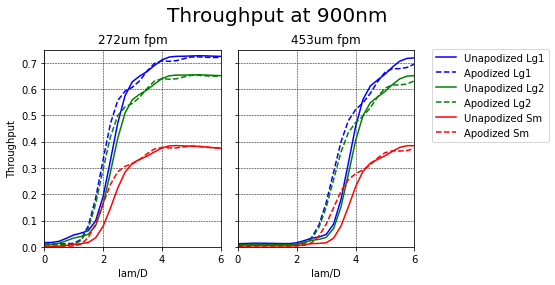
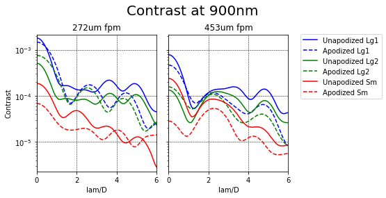
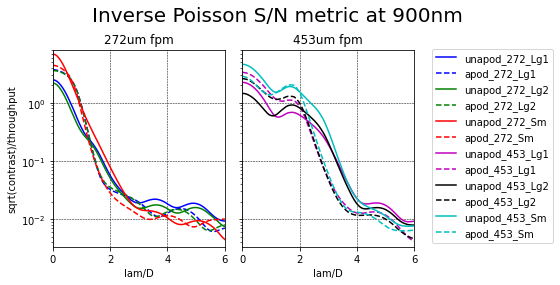

Coronagraphs
=============================

Vector Apodizing Phase Plate (vAPP)
-----------------------------------

To be documented.

Classical Lyot
-----------------------------

Pupil Masks
+++++++++++++++++++++++++++++
Two pupil masks are currently available, in addition to "open" (no mask).

.. list-table:: Coronagraph Pupil Masks
   :header-rows: 1
  
   * - fwpupil Position
     - Description
     - abs. throughput
     - design file
     - scale in telescope pupil [m/pix]
     - scale at coronagraph pupil [mm/pix]
   * - open
     - No mask, just the telescope pupil.  Note: design file includes mask over bump.
     - 100%
     - :static:`magMask.fits.gz <coronagraph/lyot/magMask.fits.gz>`
     - 0.0067528
     - 0.0093501
   * - bump-mask 
     - Undersized pupil, oversized central obscuration, oversized spiders, and mask over bump
     - 86.75%
     - :static:`bumpMask.fits.gz <coronagraph/lyot/bumpMask.fits.gz>`
     - 0.0067528
     - 0.0093501
   * - fat-spider 
     - Same as bump-mask, but one extra-oversized spider.  Intended for kernel-phase type WFS. 
     - 
     -
     -
     - 
     
Focal Plane Masks
+++++++++++++++++++++++++++++    
There are two chrome dots on glass plates. Note: optical densities are estimated from standard chrome.

Small spot: 272 um diameter.
fwfpm position: `lyotsm`

.. list-table:: lyotsm characteristics
   :header-rows: 1
  
   * - lambda [um]
     - spot size [lam/D]
     - opt. dens.
   * - 0.600
     - 3.285
     - 5.0
   * - 0.656
     - 3.00
     - 4.75
   * - 0.700
     - 2.82
     - 4.56
   * - 0.800
     - 2.46
     - 4.11
   * - 0.900
     - 2.19
     - 3.67
   * - 1.000
     - 1.97
     - 3.22

Large spot: 453 um diameter.
fwfpm position: `lyotlg`

.. list-table:: lyotlg characteristics
   :header-rows: 1
  
   * - lambda [um]
     - spot size [lam/D]
     - opt. dens.
   * - 0.600
     - 5.47
     - 5.0
   * - 0.656
     - 5.00
     - 4.75
   * - 0.700
     - 4.69
     - 4.56
   * - 0.800
     - 4.10
     - 4.11
   * - 0.900
     - 3.65
     - 3.67
   * - 1.000
     - 3.28
     - 3.22
     
     
Lyot Stops
+++++++++++++++++++++++++++++    
     
.. list-table:: Lyot Stops
   :header-rows: 1
  
   * - fwlyot Position
     - Description
     - abs. throughput
     - design file
     - scale in telescope pupil [m/pix]
     - scale at coronagraph pupil [mm/pix]
     - Image
   * - LyotLg1
     - Lyot Large 1
     - 63.82%
     - :static:`lyotMaskLarge1.fits.gz <coronagraph/lyot/lyotMaskLarge1.fits.gz>`
     - 0.0067528
     - 0.0093501
     - .. image:: figures/coronagraph_LyotLg1.png
   * - LyotLg2 
     - Lyot Large 2
     - 57.32
     - :static:`lyotMaskLarge2.fits.gz <coronagraph/lyot/lyotMaskLarge2.fits.gz>`
     - 0.0067528
     - 0.0093501
     - .. image:: figures/coronagraph_LyotLg2.png
   * - LyotSm
     - Lyot Small
     - 33.35%
     - :static:`lyotMaskSmall.fits.gz <coronagraph/lyot/lyotMaskSmall.fits.gz>`
     - 0.0067528
     - 0.0093501
     - .. image:: figures/coronagraph_LyotSm.png
     
PIAA Classical Lyot Coronagraph (PIAACLC)
------------------------------------------
Phase-induced amplitude apodization (PIAA) optics reshape the beam in the pupil and focal planes, enabling more starlight suppression at low angular separations and higher throughput at large angular separations.

Inverse apodization optics after the focal plane mask correct for off-axis field effects to remove comatic distortions on companions. Inverse PIAA optics are identical to forward PIAA optics. Optical path according to naming convention is PIAA0->PIAA1->fpm->iPIAA1->iPIAA0.

The optical schematic is described in Guyon et al 2010:

.. list-table:: PIAA optics
   :header-rows: 1
  
   * - Optic name
     - Clear aperture diameter (mm)
     - design file
     - scale in pupil [m/pix]
     - Height map (um)
   * - PIAA0
     - 10
     - :static:`piaa0.fits.gz <figures/coronagraph_piaa0.fits.gz>
     - 0.151e-5
     - .. image:: figures/coronagraph_PIAA0.png
   * - PIAA1
     - 10
     - :static:`piaa1.fits.gz <figures/coronagraph_piaa1.fits.gz>
     - 0.151e-5
     - .. image:: figures/coronagraph_PIAA1.png
     
HCIPy simulations comparing different configurations of apodization optics, focal plane masks and Lyot masks.

656nm (λ/D = 20.81marcsec)

900nm (λ/D = 28.56marcsec)

