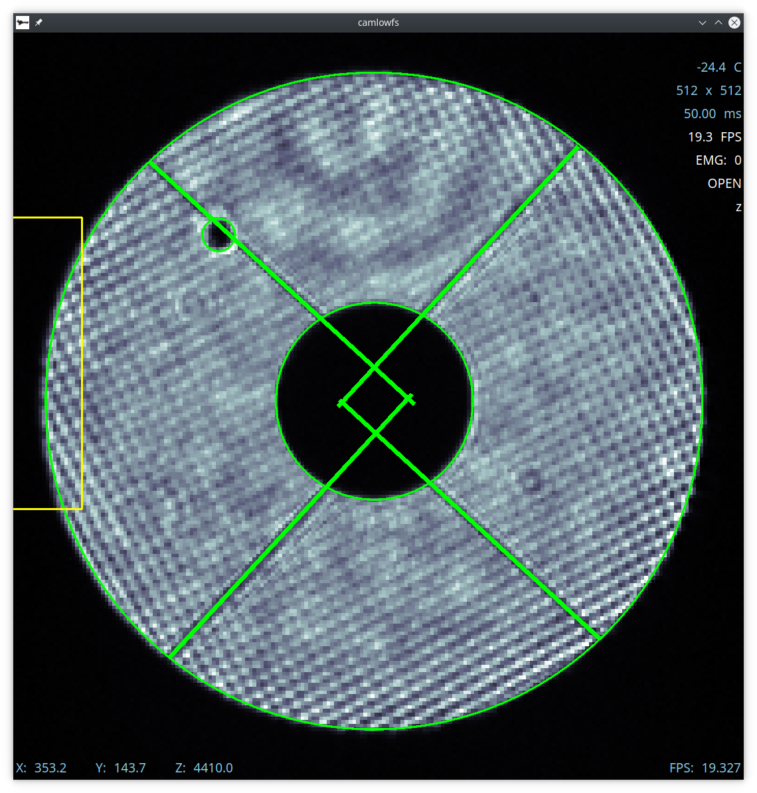
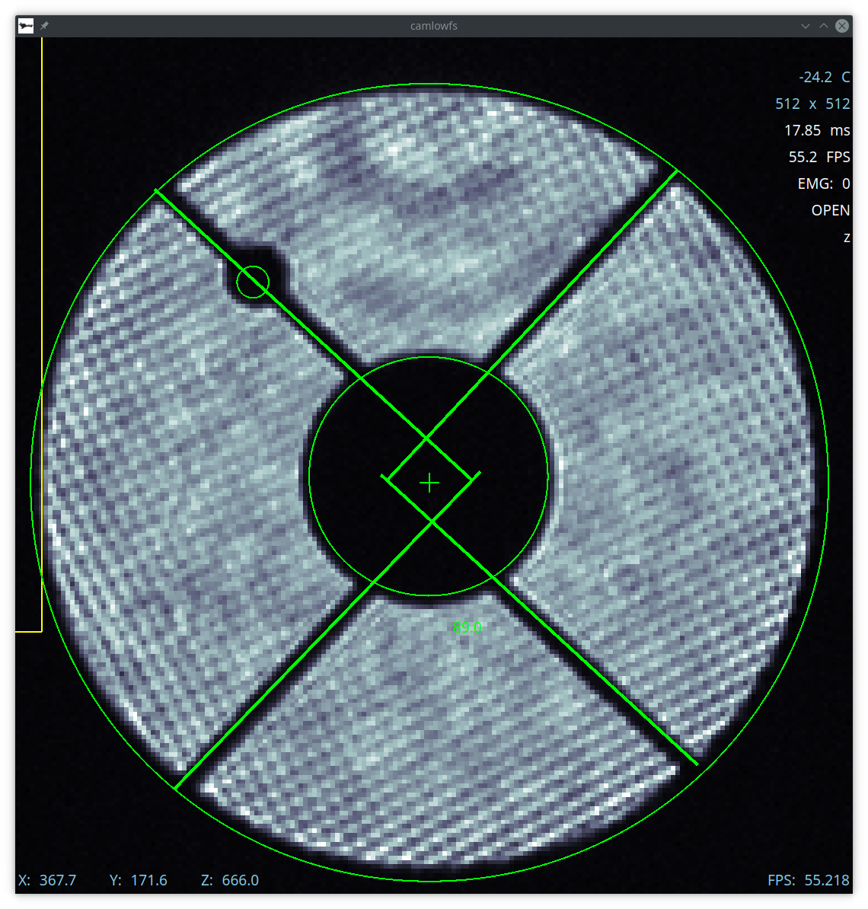
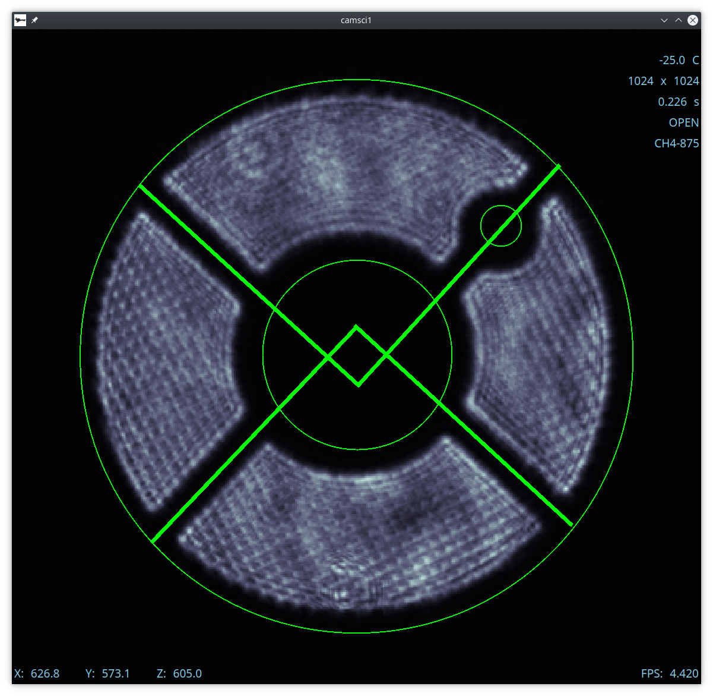
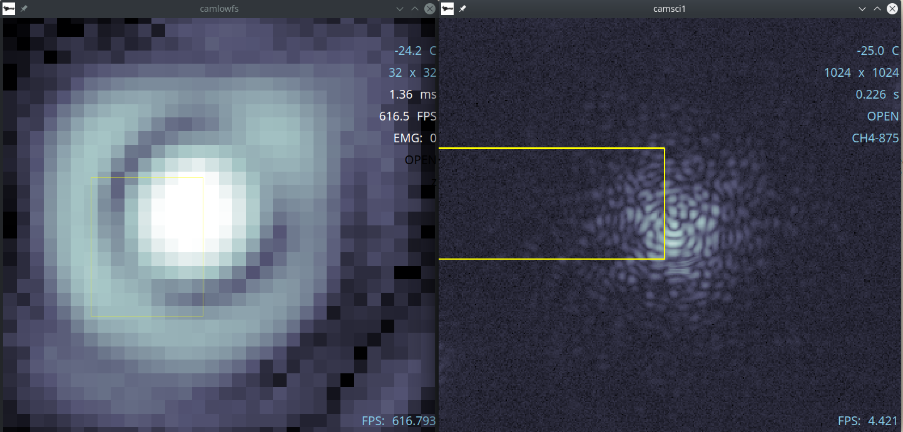
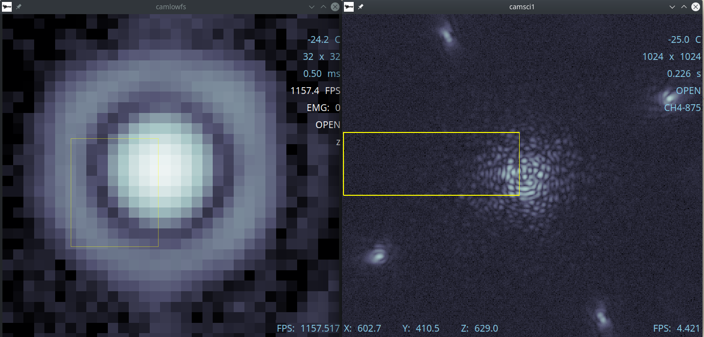

Alignment
===================================

System Pupil Alignment
-----------------------------------

Tweeter Pupil Alignment (F-Test)
~~~~~~~~~~~~~~~~~~~~~~~~~~~~~~~~~~~~

To align the pupil on the tweeter, we perform the F-Test.

Prepare the system as in :doc:`daily_startup`, then configure:

* **fwpupil** to **open** (in Coronagraph Alignment GUI)

* **fwfpm** to **open**

* **fwlyot** to **open**

* **fwscind** to **pupil** (in camsci1Ctrl)

* **fwsci1** to **z** (in almost all cases you should align in ``z`` for repeatability)

* configure **camsci1** so that you can see the pupil without saturating.

* as needed, move **stagesci1** to focus the pupil image.  You want to be somewhat out of focus to see the test pattern well.  The preset **fpm** works well.

Now put the test pattern on the tweeter with **Pupil Alignment GUI** for dmtweeter.  Press the **set test** under **tweeter**

Next, use the "Pupil Steering" section to align the pupil on the tweeter using the arrow keypad .  The following figure demonstrates what a good alignment looks like.  

.. image:: f-test-good.png
    :width: 500
    :align: center
    
Note that you may need to change the focus by moving **stagelowfs**.

When done, press the **zero test** button on dmCtrl GUI for dmtweeter.

When done, press the **zero test** button on dmCtrl GUI uner **Tweeter**.

NCPC Pupil Alignment (J-Test)
~~~~~~~~~~~~~~~~~~~~~~~~~~~~~~~~~~~~

To align the pupil on the NCPC DM, we perform the J-Test.

Prepare the system:

* **fwpupil.filterName** in **open**

* **fwfpm.filterName** in **open**

* **fwlyot.filterName** in **open**

* **fwscind.filterName** in **pupil**

* **fwsci1.filterName** in **z** (in almost all cases you should align in `z` for repeatability)

* configure **camsci1** so that you can see the pupil without saturating.

* Move **stagesci1** to preset **jtest**.

Now put the test pattern on the NCPC with **Pupil Alignment GUI** for dmncpc.  Press the **set test** under **NCPC**

Next, use the "TTM Peri" section to align the pupil on the tweeter using the arrow keypad.
The following figure demonstrates what a good alignment looks like.

Pyramid Alignment
~~~~~~~~~~~~~~~~~~~~~~~~~~~~~~~~~~~~

Sorry we haven't documented this.  Volunteers welcome.

Coronagraph Alignment
------------------------------------

NOTE: these steps are out of date compared to how we now do it.  Talk to Jared or Sebastiaan for more info.

Due to their (lack of) intrinsic repeatability, the three wheels holding the coronagraph components must be adjusted every time they are moved.  Aligning the coronagraph should proceed in the following order so that wheels do not need to be moved after adjustment.  The first step "Pupil Mask Alignment" *should be conducted every time the system is started up*.

Also note that the pupil imaging optics are not repeatable, so if the fwscind lens is moved, or the stagelosel position is changed, the pupil will appear to shift.  This does not mean the pupil has actually shifted, but will complicate checking pupil positions.

Pupil Mask Alignment
~~~~~~~~~~~~~~~~~~~~~~~~~~~~~~~~~~~~

Find and mark the pupil position on **camlowfs**:

* **fwpupil.filterName** in **open**

* **fwfpm.filterName** in **flat**

* **stagelosel.presetName** in **pupil**

* **fwlowfs.filterName** in **z**

* **camlowfs** settings can be adjusted.  Typical settings are

  - **exptime** = **0.05**

  - **readout_speed** = **emccd_17MHz**

  - **vshift_speed** = **3_3us**

* **camlowfs.shutter** to **open**

* adjust **stagelowfs** until features are sharp (spiders and bump).  Being slightly out of focus helps locate the bump effects.

* mark the unobstructed pupil location.  The below figure shows a typical example on **camlowfs**

Now align the desired pupil mask.  First select the presets for the mask:

* Return ``stagesci1`` to the ``fpm`` position

* **picomotors.picopupil** in desired position (matching **fwpupil**)

Now open coronaAlignGUI and use the "Pupil Plane" buttons to move the mask.  The following figure shows a typical exampe of bump-mask alignment

Do not move fwpupil anymore.

Lyot Stop Alignment
~~~~~~~~~~~~~~~~~~~~~~~~~~~~~~~~~~~~

* Set **fwfpm.filterName**:

* Using the directional buttons under the "Pupil Fitting" section to move the pupil images on camwfs until the "Avg:" x and y displacements are less than 0.1 pixel.

    + select the desired mask

    + **stagelosel.presetName** = fpm

    + using the coronaAlignGUI "Lyot Plane" left-right buttons, move the spot so it is not obstructing the beam.  You will see two approx equal images (one is a ghost).

    + adjust **dmncp** focus using such that the spots are roughly in focus.

    + note that you may need to adjust **camlowfs** due to saturation

 - otherwise, select **open**

* **fwscind.filterName** = **pupil**

Work your way up the mode blocks in the loop control GUI. As you close more modes, return to the directional buttons under the "Pupil Fitting" section of the Alignment GUI and try to keep the displacements under 0.1 pixel.

Coronagraph Alignment
---------------------

From the **camsci1** gui, set

    * **fwscind** to **pupil**
    * **stagesci1** to **telsim**
    
With the camsci1 shutter **open**, take a new dark. This will serve as the reference for alignment.

In the coronagraph alignment GUI: set **fwpupil** to **bump-mask**.

The camsci1 viewer will show the difference image, making it easier to align with the (now obscured) spider arms of the pupil.

Use the "Pupil Plane" directional buttons on the coronagraph alignment GUI to align the mask to the pupil.

.. image:: figures/bump_mask_alignment.png
   :width: 500
   :align: center

Once the bump mask is aligned, remember to close the shutter on camsci1 and **take a new dark**.

Focal Plane Mask Alignment
~~~~~~~~~~~~~~~~~~~~~~~~~~~~~~~~~~~~

- **fwscind.filterName** = **open**

- **fwfpm.filterName** = **LyotLg** (or desired mask)

- **picomotors.picofpm** = **LyotLg** (or desired mask)

- **stagelosel.presetName** = **fpm**

- center **camlowfs** ROI on lower spot.  32x32 may be necessary to avoid saturation

- center **camsci1** on the image.  Once on the spot it should not be saturating in default parameters.

Now adjust Focal Plane with coronaAlignGUI until aligned.  The post-coronagraph image on **camsci1** is the best indication of good alignment. Note that **dmncpc** also impacts alignment, and until it is also optimized you will probably find a dead band where FPM wheel alignment makes no difference.  The below image illustrates this condition:

Now run eye-doctor to optimize the FPM alignment with the following command

.. code::

   [icc]$ dm_eye_doctor 7624 ncpcModes camlowfs 3 2...10 0.1

The following image illustrates a fairly good alignment of the Lyot coronagraph system:

