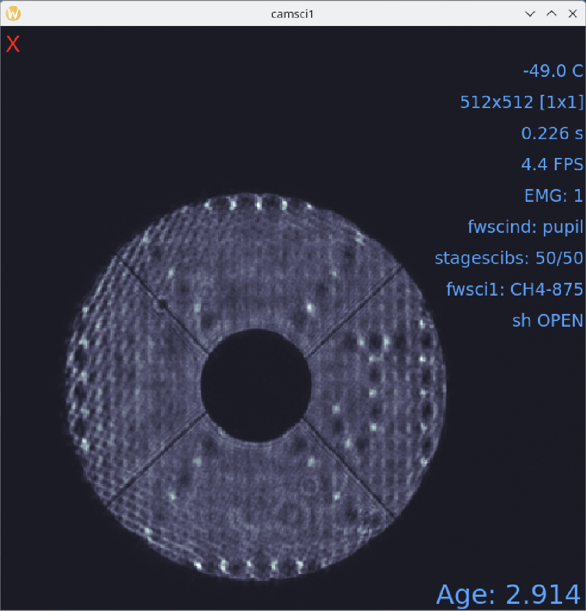

Alignment
===================================

These procedures assume that you have completed the :doc:`startup` and :doc:`daily_startup`. In other words, CACAO is configured, you have a PSF
on `camtip`, and you are modulating.

System Pupil Alignment
-----------------------------------

This procedure will align the pupils on `dmtweeter`, `dmncpc`, and `camwfs`. Things to remember:

    - `ttmpupil` is used to align the system pupil on `dmtweeter`.  We use the actuators on `dmtweeter` as the reference (the F-Test).

    - `ttmpupil` moves the image of M1 in every pupil-plane inside MagAO-X, including `dmwoofer`, `dmtweeter`, on the modulator, `camwfs`, `fwpupil` (and the very nearby `dmncpc`), `fwlyot`, and as reimaged on `camsci1`.

    - We use `ttmperi` to align the pupil in the coronagraph using `dmncpc` actuators as a reference (the J-test).

    - However, `ttmperi` moves the pupil image for all of the lower bench.  Thus it is important to remember that you are also moving the pupil on `camwfs` with `ttmperi` during the J-Test, which can affect loop stability.

    - The *camera lens*, which consists of `stagecamlensx` and `stagecamlensy`, moves the pupils on camwfs.  The primary purpose of this is to register the `dmtweeter` actuators with the `camwfs` pixels.

    - However, **on-sky** we use the position of the `camwfs` pupils to control `ttmpupil` to keep the system pupil aligned as the *K-mirror* rotates.  This only works under the assumption that the actuators are aligned to the pixels first.

    - In **the lab** moving `ttmpupil` to fix `camwfs` pupil positions mis-registers the actuators w.r.t. the `camwfs` pixels. So the *Pupil Tracking Loop* must NOT be used in lab mode.

Decide on your beam splitter
~~~~~~~~~~~~~~~~~~~~~~~~~~~~

All of the alignment uses cameras downstream of the `stagebs` science/WFS beamsplitter, and changing beamsplitter causes shifts in both the pupil and focal plane.  Thus a change of beamsplitter will invalidate your alignment and require you to repeat these steps.

Decide whether you're using H-alpha / IR or 65-35 first, and configure `stagebs`.

Pupil Alignment
~~~~~~~~~~~~~~~~

This is the main pupil alignment procedure which should be followed after starting up, or after switching beam splitters.  The individual F-Test, J-Test, and `camwfs` alignments are performed when needed as part of this, and are described below.

    #. hit `t` in the `camtip` `rtimv` display to show the target cross

    #. use the keypad on Pupil Alignment GUI to **move woofer** so the PSF is on the cross

    #. check that camwfs EM gain is 1, then open shutter

    #. Continue using **move woofer** to get roughly even illumination of the pupils.  This can include adjusting focus.

    #. If using ``camflowfs``:

        i. put `fwfpm` in `knifemask`
        
        #. put ``camflowfs`` in :guilabel:`default` ROI, and press :kbd:`t` to show the target cross on its display.

        #. Open the ``camflowfs`` shutter. If you do not see a PSF on ``camflowfs``:

            - If you have already completed the alignment successfully, but are now switching beamsplitters: use the drop-down box to select the new beamsplitter.

            .. warning::
                Do **not** use the drop-down unless you are sure that you need to.  This is a relative move equivalent to hitting the arrow keys many times. It is not an absolute move to a setpoint. Do not use this to troubleshoot!

            - ``camsci1`` has a wider FOV.  Make sure `fwscind` is not in `pupil`, move `fwfpm` to `open`, then use `camsci1` to find the spot.

            - If you can see it on `camsci`, use `pico sci-x` to move the spot to roughly centered on `camsci1`, then return to `camflowfs`.

            - If you do not see the spot on either `camflowfs` or `camsci1` then something is wrong.  Check all filter wheel and stage positions, ensure shutters are responding and open.

        #. On *Pupil Alignment Gui* use the `pico sci-x` buttons to move the PSF left and right to center on the target

            - See above warning regarding using the drop-down selection for changing beamsplitters.

            - Use the arrow buttons to move, changing the scale for finer control

            - The PSF should be centered on the target in the `camflowfs` display

    #. If not using ``camflowfs`` (i.e. using ``camsci1`` to align):

        i. Set ``camsci1`` to the :guilabel:`full` ROI
        #. Take a dark and then open the ``camsci1`` shutter
        #. Ensure ``fwscind`` is not in ``pupil``, move ``fwfpm`` to ``open``, then find the spot in the ``camsci1`` image
        #. If you cannot see a PSF, something is wrong upstream. Check upstream filters and stage positions, shutters, etc.
        #. On *Pupil Alignment Gui* use the `pico sci-x` buttons to approximately center the PSF on ``camsci1``

    #. Next set woofer offloading to 2 modes

    #. Close the loop on tip/tilt only

        - low gain is fine.  Multiplication Coefficient should be 1.0

    #. If using ``camflowfs``:

        i. Now select :guilabel:`move ttm` on lower left of *Pupil Guide Gui*

        #. With the loop closed:

            - move up and down with the arrows to center on the target on `camflowfs` in y.
            - also clean up any remaining x alignment with `pico sci-x`.

    #. Keeping the loop closed, you can now start :guilabel:`Auto Alignment` of the ``ttmpupil`` and ``cameralensx``/``cameralensy`` devices

        - Monitor the `camwfs` pupil position to ensure it does not run away

            - If they do run away, :guilabel:`Stop` the auto alignment. You may need to use :guilabel:`Loop Zero` on the loop control GUI and the :guilabel:`Zero` button on the Offloading Ctrl GUI to remove spurious tip-tilt corrections.

        - Monitor "Pupil Tracking Loop" and "Actuator Alignment Loop" deltas.

    #. Once the loops have converged ("Pupil Tracking Loop" and "Actuator Alignment Loop" deltas less than 0.05 in the lab) stop the :guilabel:`Auto Alignment` loop.

        - In the lab the `Pupil Tracking Loop` should turn off when you stop the :guilabel:`Auto Alignment` loop.

        - On sky the `Pupil Tracking Loop` should remain on when you stop the :guilabel:`Auto Alignment` loop.

    #. Adjust flux on `camwfs` using `flipwfsf` and `fwtelsim`, and set `camwfs` EM gain.

        - you may need to reset protection

    #. take a camwfs dark

    #. now close the loop, up to ~200 modes

        - bring up t/t, then focus, then higher order modes block by block

        - Once 10 modes are closed, increase Woofer Offloading to 10 modes

    #. Now repeat the :guilabel:`Auto Alignment` steps above with the loop closed

    #. Once the :guilabel:`Auto Alignment` has converged again, stop it.

    #. Now perform the :ref:`J-test <jtest>` (below).  Once the J-test is complete, you need to re-align the `camwfs` pupils using the camera lens by hand.  **Do not** run :guilabel:`Auto Alignment` at this step.

    #. You should now be able to close all modes.

        - Once all modes are closed, you may need to adjust camera lens position with the directional buttons on the Alignment GUI. Do not use :guilabel:`Auto Alignment` for this.

Tweeter Pupil Alignment (F-Test)
~~~~~~~~~~~~~~~~~~~~~~~~~~~~~~~~~~~~

This does not need to be done if you have performed the :guilabel:`Auto Alignment`, however it is usually good to check it to make sure the automatic loop has converged properly.

.. note::
    If you modify the F-Test by actuating `ttmpupil`, you will need to re-do both the J-Test and the `camwfs` pupil alignments.

To manually align the pupil on the tweeter, we perform the F-Test (which is now actually an R).

* **fwpupil** to **open** (in Coronagraph Alignment GUI)

* **fwfpm** to **open**

* **fwlyot** to **open**

* **fwscind** to **pupil** (in camsci1Ctrl)

* **fwsci1** to **z**

* configure **camsci1** so that you can see the pupil without saturating.

* Move **stagesci1** to preset **fpm**.

* If necessary, use the "Loop Zero" buttons to remove any leftover AO corrections.

Now put the test pattern on the tweeter with **Pupil Alignment GUI** for dmtweeter.  Press the **set test** under **Tweeter**

Next, use the "TTM Pupil" section to align the pupil on the tweeter using the arrow keypad.
The following figure demonstrates what a good alignment looks like.

.. image:: f-test-good.png
    :width: 500
    :align: center

When done, use the Tweeter **zero test** button on the Alignment GUI.

Decide on your beam splitter
~~~~~~~~~~~~~~~~~~~~~~~~~~~~

The J-test and later alignment takes place downstream of the ``stagebs`` science/WFS beamsplitter, so a change of beamsplitter will invalidate your alignment and require you to repeat those steps.

Decide whether you're using H-alpha / IR or 65-35 first, and configure ``stagebs``.

.. _jtest:

NCPC Pupil Alignment (J-Test)
~~~~~~~~~~~~~~~~~~~~~~~~~~~~~~~~~~~~

To align the pupil on `dmncpc`, we perform the J-Test.

.. note::
     `ttmperi` moves the pupil on the lower bench, including on `camwfs`.  This means performing the J-Test in closed-loop can cause instability. You will need to manually adjust pupil position on `camwfs` with the *camera lens*.

.. note::
     The F-Test (above) also changes the J-Test. The J-Test should only be performed after the F-Test (or :guilabel:`Auto Alignment`) is complete.

The system should be configured for the F-test above (in particular, check that ``fwscind`` is in ``pupil``). Next,

* Move **stagesci1** to preset **jtest-telsim**.

* Put the test pattern on the `dmncpc`` with the "Set Test" button next to "NCPC" on the **Pupil Alignment GUI**.

* Press the **set test** under **NCPC**

Next, use the arrow buttons below :guilabel:`TTM Peri` to align the pupil on the NCPC DM.
The following figure demonstrates what a good alignment looks like.

* Clear the J-test with the "zero test" button on the **Pupil Alignment GUI**

* Return `stagesci1` to the `fpm` position

Post-J-test Pyramid Pupil Alignment
^^^^^^^^^^^^^^^^^^^^^^^^^^^^^^^^^^^

If you have performed the :guilabel:`Auto Alignment` this only needs to be done after performing the J-test.

* Check the offsets under :guilabel:`Pupil Tracking Loop` in the **Pupil Alignment GUI**

* Using the directional buttons under the "Camera Lens" section to move the pupil images on camwfs until the x and y displacements are less than 0.05 pixels in the lab (0.1 pixels on-sky).

.. warning::

    The "pupil tracking loop" is not used in lab mode, only on-sky.

Focal Plane and Coronagraph Alignment
-------------------------------------

Automated Bump Mask and Lyot Stop Alignment
~~~~~~~~~~~~~~~~~~~~~~~~~~~~~~~~~~~~~~~~~~~
Put ``fwscind`` into **pupil** mode. Then, from the **Coronagraph Alignment GUI**, change **fwpupil** to **bump-mask**. Make sure that ``camsci1`` is in the :guilabel:`full` ROI and that ``stagesci1`` is at position 54.5.

Then, in **cursesINDI**, navigate to **pupilCorAlign** and toggle **pupilCorAlign.state.centroid** ON. A pattern should appear on ``dmncpc``. Then, toggle **pupilCorAlign.state.fwpupil** ON. You should see the properties **fwpupil.dx** and **fwpupil.dy** start to change. Wait for these numbers to converge to a magnitude less than about 0.2, then toggle **pupilCorAlign.state.idle** ON to stop the process. The bump mask should now be aligned.

.. note::
    The pattern on ``dmncpc`` sometimes freezes, and the app stops working. To fix this, go to a terminal on ``icc`` and, as ``xsup``, do         ``xctrl restart pupilCorAlign``, and that should fix things. You do **not** have to redo the centroid step after the restart.

Now, use the **Coronagraph Alignment GUI** to put ``fwlyot`` into your desired Lyot stop, usually **LyotLg1**. Toggle **pupilCorAlign.state.fwlyot** to ON and watch the values under **fwlyot.dx** and **fwlyot.dy**. Once they converge to a magnitude <0.2, toggle **pupilCorAlign.state.idle** ON to stop the process. The Lyot stop should now be aligned. 

Manual Bump-Mask Alignment
~~~~~~~~~~~~~~~~~~~~~~~~~~

From the **camsci1** gui, set

    * **fwscind** to **pupil**
    * **stagesci1** to **jtest-telsim**

With the camsci1 shutter **open**, take a new dark. This will serve as the reference for alignment.

In the coronagraph alignment GUI: set **fwpupil** to **bump-mask**.

The camsci1 viewer will show the difference image, making it easier to align with the (now obscured) spider arms of the pupil.

Use the "Pupil Plane" directional buttons on the coronagraph alignment GUI to align the mask to the pupil.

.. image:: figures/bump_mask_alignment.png
   :width: 500
   :align: center

Once the bump mask is aligned, change **fwscind** back to whatever you had before switching to pupil imaging mode.

Remember to close the shutter on camsci1 and **take a new dark**.

.. _fdpr2:

Focus Diversity Phase Retrieval (FDPR)
~~~~~~~~~~~~~~~~~~~~~~~~~~~~~~~~~~~~~~

To further improve PSF quality, run focus diversity phase retrieval (FDPR) on camsci1 to derive a new non-common-path correction DM shape.

There are multiple ways to configure the algorithm (see :doc:`./software/utils/fdpr`), but we most commonly use the `CH4-875` filter in camsci1 to compute a correction applied to `dmncpc`.

    #. Configure fwsci1 with the narrow-band methane filter `CH4-875`
    #. Place stagesci1 at preset `fpm`
    #. Define a :term:`ROI` centered on the core of the PSF of size 369x369
    #. Adjust exposure times as needed to have plenty (25000--30000) of counts in the peak of the PSF
    #. Close the shutter and take new darks. (Then open the shutter.)
    #. Open a terminal on ICC
    #. `export OPENBLAS_NUM_THREADS=1` to avoid bogging down ICC with the process (TODO: make this automatic)
    #. Run the FDPR process with: `fdpr2_close_loop fdpr2_dmncpc_camsci1_CH4`
    #. Save the flat with `dm_save_flat ncpc -d fdpr`
    #. On `dmncpc` zero all channels, then select the new flat in the drop down and apply it.
