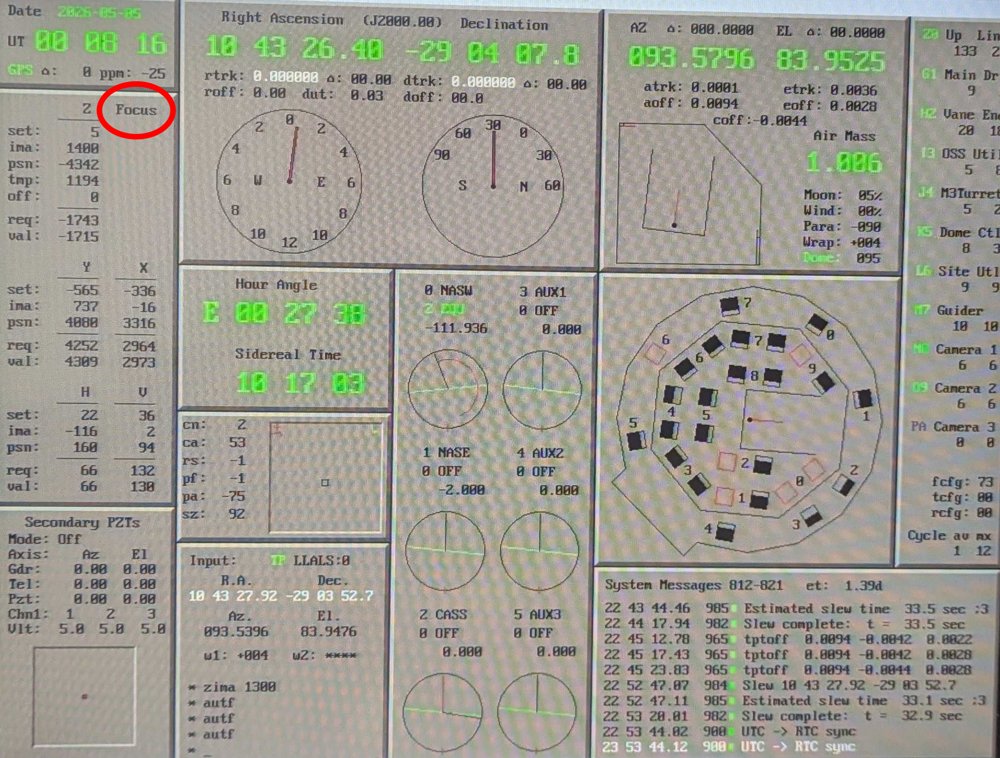

Managing Autofocus Vibrations
===================================
The telescope `autofocus` system updates the secondary position at intervals based on elevation and temperature using a lookup table.  The problem for MagAO-X is that this imparts high-frequency vibrations (significant on lambda/D scales) on the telescope.  For the best residual tip/tilt performance we can operate with `autofocus` off with the following procedure.

    The Clay TCS display.  Circled in red is the `autofocus` status, here shown `off`.  When `on`, the word "Focus" turns green.

Important Things
----------------------
- The telescope operator has to manually disable/enable `autofocus`.
- When `autofocus` is disabled, we can not dump focus to the telescope.  **This is the key caveat to using this procedure.**
- Turning `autofocus` back on after a period of no corrections will throw the star off the pyramid, breaking the HO loop.
- Be sure to re-enable `autofocus` before slewing to a new target.
- Plan to perform this procedure 30 minutes before transit even if the threshold hasn't been reached.

Procedure
-----------------------

1. TO slews to the target with `autofocus` on as usual.
2. Perform MagAO-X acquisition and close the loop
3. Once the loop is closed, wait about 10 sec, then dump focus to the telescope

   -  If the amplitude is very large (>~50), wait another 10 sec and dump again

4. Now ask the TO to disable `autofocus`
5. Begin taking data
6. Monitor the focus build-up on the woofer

   - You can press the focus dump button and observe the amount that would be sent, even though the command will have no effect.

7. Once the amplitude gets large (>~ 75) it is time to fix it.  Do the following:

   a. Make the science cameras EM gain safe, i.e. close the shutters (this is a good chance to take a few darks)
   b. Open the loop.
   c. Ask the TO to enable `autofocus`.  This will likely throw the star off the pyramid.
   d. put in `flipacq` and turn on `camacq`
   e. take a `camwfs` dark because it's a good time to do it
   f. Move the telescope to re-acquire the star on the pyramid
   g. remove `flipacq` and turn off `camacq`
   h. close the loop
   i. ask the TO to disable autofocus
   j. return to you regularly scheduled data taking

8. Repeat step 6 and 7 until you are done with the observation
9. Open the loop
10. Ask the TO to enable `autofocus`
11. Goto step 1.
