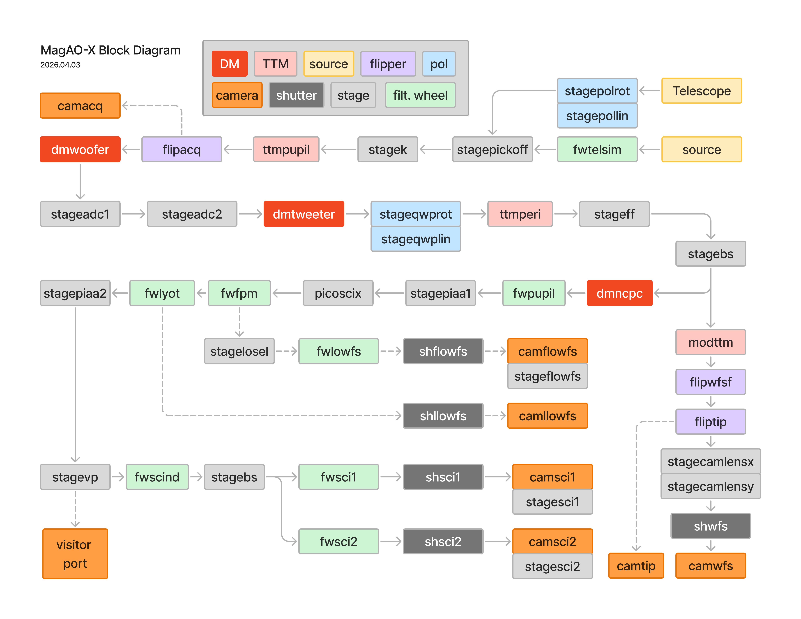

Functional Block Diagram
===================================

Updated April 3, 2026

26A - Visitor port stage has changed from `visport` to `stagevp`.
26A - Quarter wave plate rotator `stageqwprot` and linear stage `stageqwplin` installed. 

