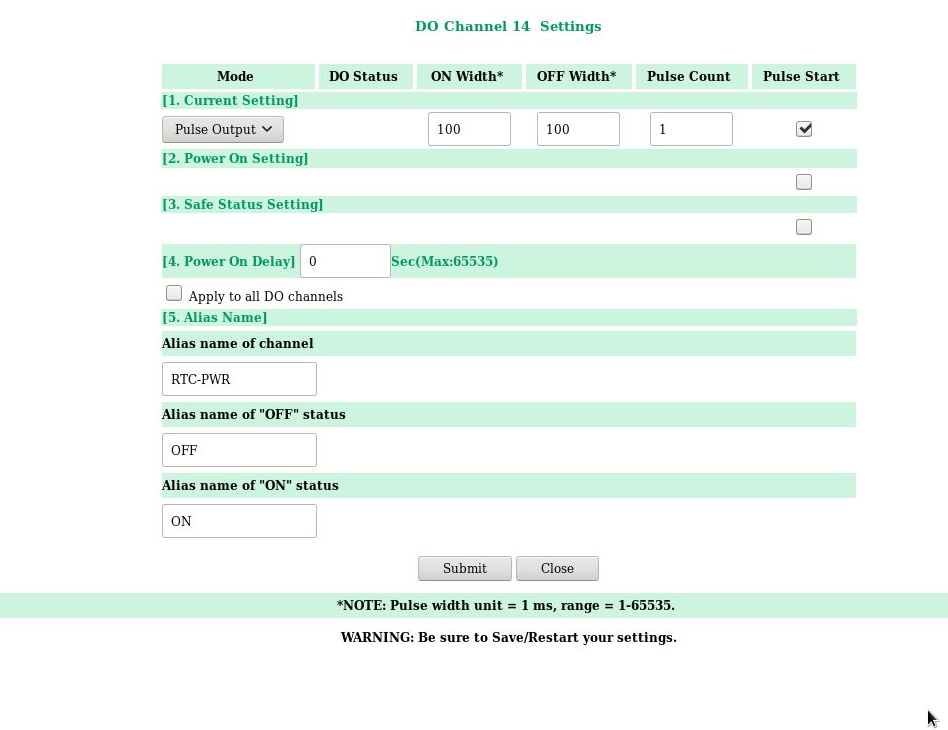
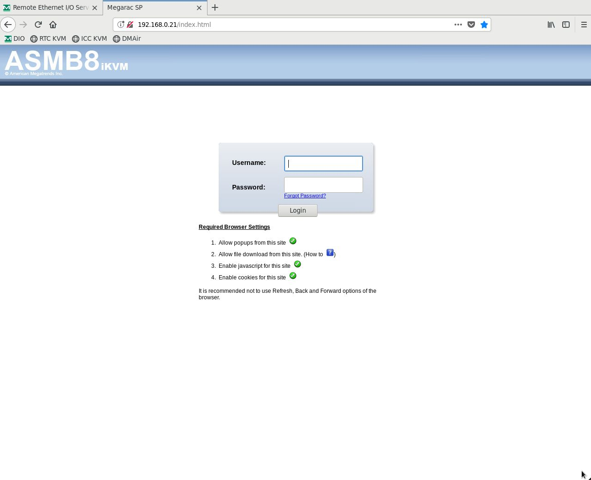

Daily Startup
=============

The steps below assume that the steps in "System Powerup" are complete. This will
generally be the instrument state on a daily basis.

1. On the `pwrGUI` verify the following items are on:

   -  pdu3.blower
   -  pdu3.fanaux
   -  pdu3.fanmain
   -  pdu3.instcool

If any of these are off, stop and investigate.  These are safety issues and you should not go on.

3.  On the `pwrGUI`,  verify that the following items are  on:

   -  pdu0.compicc
   -  pdu0.comprtc
   -  pdu0.dcpwr
   -  pdu0.swinst
  
If any of these are off the instrument probably won't work.  

1. Ensure MagAO-X processes are started on AOC, ICC and RTC.  We do this by running `xctrl status` on each machine.

   ::

      # starting with AOC:
      [[xsup@exao1 ~]$ xctrl status
      # verify processes are all green/running
      # next on ICC:
      [[xsup@exao1 ~]$ ssh icc
      [[xsup@exao3 ~]$ xctrl status
      # verify processes are all green/running
      [[xsup@exao3 ~]$ exit
      # now for RTC:
      [[xsup@exao1 ~]$ ssh rtc
      [[xsup@exao2 ~]$ xctrl status
      # verify processes are all green/running
      [[xsup@exao2 ~]$ exit

2. Power up the MagAO-X components:

   -  dcdu0: all devices
   -  dcdu1: all devices
   -  pdu0: source, ttmperi (other devices are already one as above)
   -  pdu1: all devices [check humidity before dmncpc and dmtweeter]
   -  pdu2: all devices
   -  pdu3: flippers, tableair.  camvisx and turbsim are maybe. (other devices are already on as above)
   -  pduhcat: if you are using GMT HCAT, all devices on. (only in lab)
   -  usbdu0: all devices
   -  usbdu1: camvisx is maybe.  all other devices.

3. Set the flat on all three DMs.

4. For lab work, put `stagepickoff` in `lab`.  At the telescope it must be in `tel` to see a star.

5. Now ``set`` the pupil TTM and ``set`` the pyramid modulator TTM on the "Pupil Alignment GUI. 

6. At this point you should see a PSF image on `camtip`.   If you don't use the system block diagram to troubleshoot.  
   The most likely causes are your forgot to power something on (the source?) and `stagepickoff` is in wrong position.

7. Now you can proceed to alignment

.. |image1| image:: moxa_dio_do.png

.. |image4| image:: rtc_ikvm_launch.png
.. |image5| image:: rtc_ikvm_f1.png
.. |image6| image:: rtc_save_and_exit_yes.png
