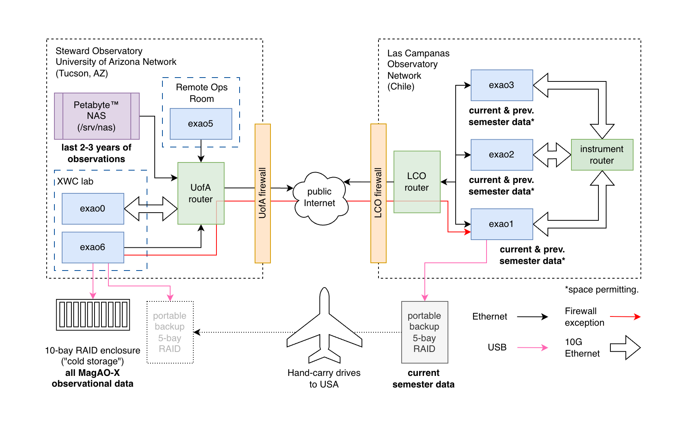

Data export and archiving
=========================

   Schematic representation of the connections between our computers and which data live where

Fresh observations are picked up by a background process called ``lookyloo`` on exao1/AOC and converted to FITS with appropriate headers using ``xrif2fits``, which has access to all the files the instrument has just saved.

Easy mode
---------

If the observation is recent, and you are only looking for ``camsci1`` and ``camsci2`` data, they will already be in ``/home/guestobs/obs`` on exao1. You can download the observation from there following the instructions in :doc:`../observers/data_access`.

Exporting another stream from a recent observation
--------------------------------------------------

Only ``camsci1`` and ``camsci2`` get automatically exported, but there are other streams you could save while observing. To export those with ``xrif2fits`` you have two options: invoke ``xrif2fits`` directly, or use the ``lookyloo`` command-line interface.

The available options are documented in the help::

   jlong@exao1:~$ lookyloo -h
   usage: lookyloo [-h] [-r] [-i] [-C] [-S] [-v] [-t TITLE] [-o OBJECT]
                  [-e OBSERVER_EMAIL] [-p] [--find-partial-archives] [-s SEMESTER]
                  [--utc-start UTC_START] [--utc-end UTC_END] [-c CAMERA]
                  [-X DATA_ROOT] [-O] [--ignore-data-integrity] [-D OUTPUT_DIR]
                  [--xrif2fits-cmd XRIF2FITS_CMD] [-j PARALLEL_JOBS]

   Quicklookyloo

   options:
   -h, --help            show this help message and exit
   -r, --dry-run         Commands to run are printed in debug output (implies
                           --verbose)
   -i, --ignore-history  When a history file (.lookyloo_succeeded) is found under
                           the output directory, don't skip files listed in it
   -C, --cube-mode-all   Whether to write all archives as cubes, one per XRIF,
                           regardless of the default for the device (implies --omit-
                           telemetry)
   -S, --separate-mode-all
                           Whether to write all archives as separate FITS files
                           regardless of the default for the device
   -v, --verbose         Turn on debug output
   -t, --title TITLE     Title of observation to collect
   -o, --object OBJECT   Object name
   -e, --observer-email OBSERVER_EMAIL
                           Skip observations that are not by this observer (matches
                           substrings, case-independent)
   -p, --partial-match-ok
                           A partial match (title provided is found anywhere in
                           recorded title) is processed
   --find-partial-archives
                           When recording starts after stream-writing, archives may be
                           missed. This option finds the last prior archive and
                           exports it as well.
   -s, --semester SEMESTER
                           Semester to search in, default: 2026A
   --utc-start UTC_START
                           ISO UTC datetime stamp of earliest observation start time
                           to process (supersedes --semester)
   --utc-end UTC_END     ISO UTC datetime stamp of latest observation end time to
                           process (ignored in daemon mode)
   -c, --camera CAMERA   Camera name (i.e. rawimages subfolder name), repeat to
                           specify multiple names. (default: ['camsci1', 'camsci2'])
   -X, --data-root DATA_ROOT
                           Search directory for telem and rawimages subdirectories,
                           repeat to specify multiple roots. (default: ['/opt/MagAOX',
                           '/srv/icc/opt/MagAOX', '/srv/rtc/opt/MagAOX'])
   -O, --omit-telemetry  Whether to omit references to telemetry files
   --ignore-data-integrity
                           [DEBUG USE ONLY]
   -D, --output-dir OUTPUT_DIR
                           output directory, defaults to current dir
   --xrif2fits-cmd XRIF2FITS_CMD
                           Specify a path to an alternative version of xrif2fits here
                           if desired
   -j, --parallel-jobs PARALLEL_JOBS
                           Max number of parallel xrif2fits processes to launch (if
                           the number of archives in an interval is smaller than this,
                           fewer processes will be launched)

The only reason to use ``lookyloo`` is that it knows how to read telemetry from ``observers``, the INDI device that starts and stops observations. So, it can group your FITS files by the configured observation observer, time, target, and name.

If you already know which ``.xrif`` files you need, you should use ``xrif2fits`` directly.

**Example command for lookyloo:** Suppose you want to export camsci1 and camwfs data from an observation in 2025B named something containing ``betaPic`` (but you can't remember the exact title)::

   lookyloo -c camsci1 -c camwfs -t betaPic -p -s 2025B

If you're on ``exao1``, and it's still the 2025B semester (or close enough), this command will "just work" and create a folder tree with the correct structure in whatever directory you ran it from.

After older data have been moved, you will need to supply ``--data-root`` (``-X`` for short) arguments for all the places relevant files may be found. See the next section.

Exporting from the archive
--------------------------

Accessing archival data is a bit more complicated than fresh observations.

After the files have been uprooted from the instrument and moved to long-term storage, you will need to identify the most likely home for your image data. From the above diagram, ``/srv/nas`` is a good bet for recent data. Otherwise you will need to connect to ``exao6`` and run the export from there.

Ensure you have (or have access to) an up-to-date version of the MagAO-X C++ software and ``lookyloo`` tool. The ``xrif2fits`` tool depends on the telemetry subsystem to look up header values, and that can get updated with new types of telemetry. (The one on the instrument is kept up-to-date by necessity, but the same is not true of other installs.)

In this example, the hand-carried backup drive is connected via USB and mounted at ``/mnt/backup``. The backup is organized by role (``aoc``, ``rtc``, ``icc``) and the MagAO-X data roots for each instrument computer are within::

   $ ls /mnt/backup/aoc/opt/MagAOX
   cacao  calib  logs  rawimages  telem

So in this case, you would include ``--data-root /mnt/backup/aoc/opt/MagAOX`` in your lookyloo command. However, this will only be enough to find the observers telem (saved on AOC). You will also need ``--data-root /mnt/backup/rtc/opt/MagAOX`` and ``--data-root /mnt/backup/icc/opt/MagAOX`` to ensure you get all relevant headers populated.

To update the above example::

   lookyloo -c camsci1 -c camwfs -t betaPic -p -s 2025B \
      --data-root /mnt/backup/aoc/opt/MagAOX \
      --data-root /mnt/backup/rtc/opt/MagAOX \
      --data-root /mnt/backup/icc/opt/MagAOX

(the ``\`` lets us break up the command over multiple lines)

