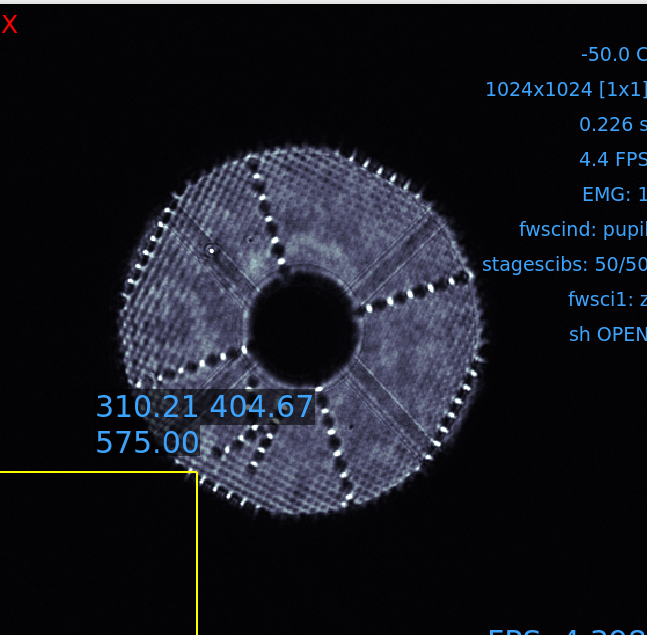
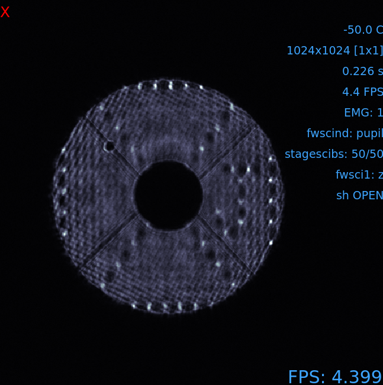
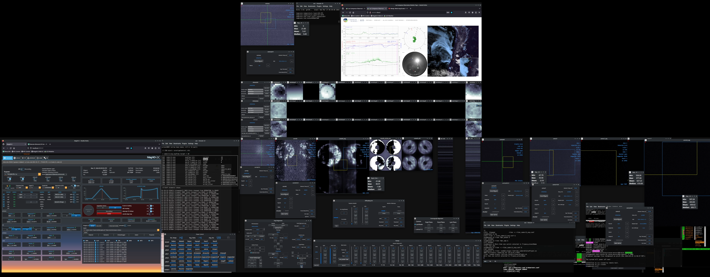
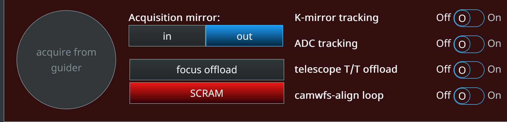
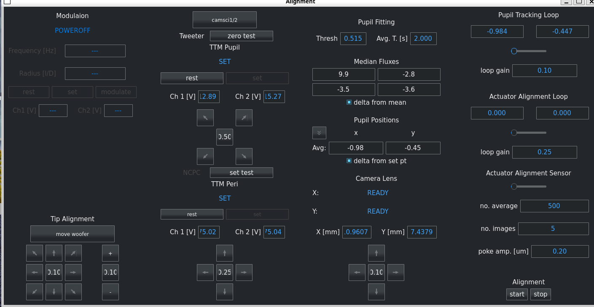
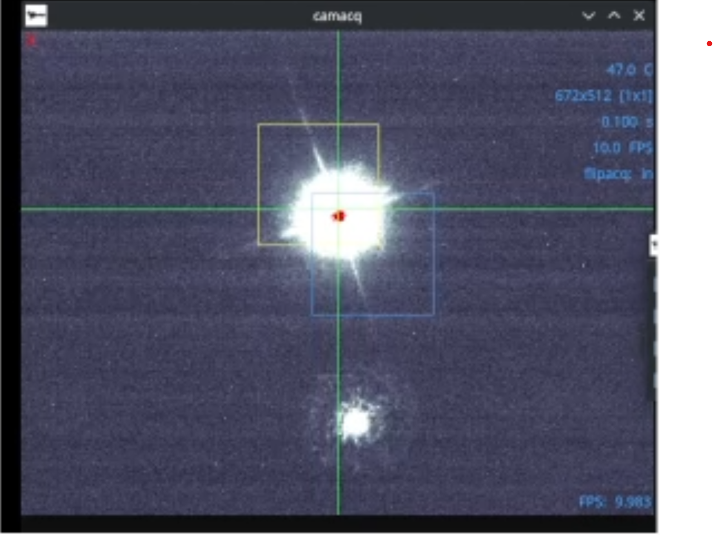
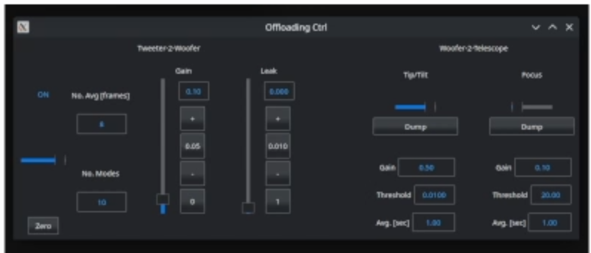
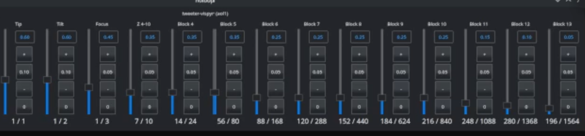

MagAO-X Lab to On-sky AO Setup
==============================

Internal Source Alignment
---------------------------
Before, aligning on a star, an initial alignment of the system must be performed with the internal source.

System Startup
~~~~~~~~~~~~~~~~~~~~~~~~~~~~~~~~~~~~
   * Power on MagAO-X via the ``pwrGUI``.
   * In the ``dmCtrl`` GUIs, set default flats on the woofer, tweeter, and NCPC DMs (TODO: INSERT PICTURE).

In TTM modulator,
   * Under ``Frequency`` type 2000 and press the enter key.
   * Under ``Radius`` type 3 and press the enter key.
   * Click ``Set`` and again wait for the modulator status to update.
   * Click ``Modulate`` (note that it will take a few minutes before the WFS begins modulating) (TODO: INSERT PICTURE)

Pupil Alignment
~~~~~~~~~~~~~~~~~~~~~~~~~~~~~~~~~~~~
1. Tweeter

   * From the ``camscixCtrl`` GUI (varies based on whether you are using camsci1 or camsci2), change ``fwscind`` to ``pupil``.
   * In the  ``pupilAlignment`` GUI, under ``Tweeter``, click ``set test``.
   * Use the arrows under ``TTM Pupil`` to adjust the illumination such that the black and white pattern appears symmetric on opposite sides of the DM: |image1|
   * Once the tweeter is evenly illuminated, click ``zero test``.
  

2. NCPC

   * In the ``Pupil Alignment``  GUI under ``NCPC``, press ``Set Test``. 
   * In ``camscixCtrl`` set ``stagescix`` to the ``J test`` focus position.  You should see a test pattern appear on the pupil. 
   * In the ``Pupil Alignment`` GUI below ``TTM Peri``, use the arrow keys to evenly illuminate the NCPC DM.
   * The final result should look something like this: |image2|
   * Once aligned, set ``stagescix`` back to FPM. 

3. CamWFS

   * In the ``Pupil Alignment``  GUI under ``Tip Alignment``, move the woofer until the pupils of the Pyramid WFS appear evenly illuminated on ``camwfs`` (TODO: INSERT PICTURE). 
   * Use the 4 buttons under ``Camera Lens`` to center the Pyramid WFS pupils. Monitor the (x, y) values under ``Pupil Tracking Loop`` as you do this. Once the (x, y) values are close to 0, you may proceed to the next step.

Closing the Loop
~~~~~~~~~~~~~~~~~~~~~~~~~~~~~~~~~~~~
In the ``HOloop`` GUI: 
   * Close the higher order loop on the first 3 blocks (tip, tilt, and defocus) (TODO: Insert Picture).
   * Monitor the DM woofer and tweeter pupils to ensure that they are not saturating (the pupils will turn red if saturated).
   * Once the HO loop is stable, open the loop and toggle the ``synchro`` slider in the the  ``camWFS`` GUI. 
   * After toggling ``synchro``, wait a few seconds before closing the HO loop on all blocks (TODO: Insert Picture).

Bump Mask Alignment
~~~~~~~~~~~~~~~~~~~~~~~~~~~~~~~~~~~~
From the ``camscixCtrl`` GUI: 
   * Change ``fwscind`` to ``pupil``
   * Move the ``stagescix`` focus position to ``telsim``
   * Take an open-shutter dark frame
   * Insert the bump mask by changing ``fwpupil`` to ``bump-mask``
From the ``corAlign`` GUI:
   * Use the buttons under ``Pupil Plane`` to move the bump mask until it is aligned on the pupil. (TODO: Insert Picture).
   * Take a closed-shutter dark.

Focus Diversity Phase Retrieval (FDPR)
~~~~~~~~~~~~~~~~~~~~~~~~~~~~~~~~~~~~~~~~~~~~
From the ``camscixCtrl`` GUI:
   * Change ``fwscix`` to ``CH4-875``.
   * Set the camera ROI to 369x369 and center the PSF (TODO: Insert Picture)
   * Adjust the ND filter/exp time/EM gain until the camera registers ~45000 counts (setting ``fwscind`` to ND0_3 will typically suffice).
   * Take a closed-shutter dark.
   * In a terminal, ssh to ``icc`` as the ``xsup`` user:

   .. code::
   
      $ ssh icc
      $ xsupify

   * Then run fdpr:

   .. code::

      [icc]$ fdpr2_close_loop fdpr2_dmncpc_camsci1_CH4

   * Continue running fdpr until you obtain a Strehl ration of ~0.94.

Coronagraph Alignment 
~~~~~~~~~~~~~~~~~~~~~~~~~~~~~~~~~~~~
Coming soon...

.. Closing the Pupil Alignment Loop
.. ~~~~~~~~~~~~~~~~~~~~~~~~~~~~~~~~~~~~

.. #. In the ``Pupil Alignment`` GUI, use the keypad in the lower-righthand corner to drive the x and y avg values to 0. After each translation, wait a few seconds for the readings to stabilize. Also note that the x-axis is much more sensitive than the y-axis. When moving x-axis avg to 0, use step sizes of about 0.1. When moving y-axis to 0, higher step sizes can be used.
.. #. Once the x, y avgs are at roughly 0, set the pupil alignment loop gain to 0.1 and turn on the pupil alignment loop.

.. With the instrument installed on the telescope and the dome open, you can proceed with on-sky operations.

.. The following assumes that you have provided the telescope operator with a target and that you are sitting at the AOC workstation. All GUIs, camera viewers, and the MagAO-X web interface should be open at this point. The GUI layout for on-sky operations on AOC will look something like this: |image1|

.. If this is the beginning of the night, start from Step 1. Otherwise, proceed to Step 2.

Telescope Target Acquisition
------------------------------
1. Modulating the WFS

   * Set the FPS on the ``camwfsctrl`` GUI to your desired frequency.
   * In CursesINDI, type ``fxngensync`` and toggle the state to ``On`` (see the `cursesINDI guide <./software/guis/cursesINDI>`__ if you need a refresher)
   * Navigate to the upper left-hand corner of the ``Pupil Alignment`` GUI. The GUI looks like this: |image5|

   In TTM modulator,
   
   * Under ``Frequency`` type your desired loop frequency and press the enter key.
   * Under ``Radius`` type your desired radius and press the enter key.
   * Click ``Set`` and again wait for the modulator status to update.
   * Click ``Modulate`` (note that it will take a few minutes before the WFS begins modulating)
   
2. Camera Safety Precautions

   *  **IMPORTANT** Set ``EM gain`` on the ``camwfsctrl``, ``camsci1ctrl``, and ``camsci2ctrl`` GUIs to ``1``. This will reduce the risk of damaging the cameras.
3. Once the telescope operator tells you that they are pointing at the target, navigate to the telescope acquisition box on the MagAO-X web interface (https://exao1.magao-x.org/#/): |image4|

   * move the acquisition mirror to the ``In`` position
   * Set ``K-mirror tracking``, ``ADC tracking``, and ``telescope T/T offload`` to ``On``.
   * Press the ``acquire from guider`` button (it should light up red after putting in the acquisition mirror). You are now controlling the telescope.

4. If observing in Halpha:

   * Set ``stagebs`` on the web interface to ``Ha-ir``
   
Otherwise:
      * Set ``stagebs`` to ``65-35``

1. You should see a star appear on ``camacq``.

   * TODO: Fill in this section with new ``camacq`` procedure. The star will look something like this when aligned on camacq: |image5|
   * In the web interface, move the acquisition mirror to the ``Out`` position. Now, increase ``EM gain`` under ``camwfsctrl`` (for fainter targets an EM gain of ``600`` is sufficient). This will put more light on camwfs. 
   * Now, look at ``camwfs``. Reduce the step size under ``Move Telescope`` and finely adjust the telescope pointing until the pupils on ``camwfs`` appear evenly illuminated.

2. Closing the Loop

   * In the ``OffloadingCtrl`` GUI, drag the slider to ``On`` and set the gain to ``0.1``. |Image7|
   * In the ``holoop`` GUI, click ``Zero All`` to remove any existing loop gain settings.
   * Raise the global gain to ``1.0``.
   * Drag the slider from the ``Open`` to the ``Closed`` position. 
   * Raise tip and tilt to gains of roughly ``0.1`` - ``0.2``. 
   * Raise focus to a gain of ``0.1``.
   * In the ``OffloadingCtrl`` GUI under ``Focus``, press ``Dump``.
   * Monitor the DM displays to ensure that the DMs are not heavily saturating (the DM will turn red when it saturates). 
   * If the loop reopens, press ``Zero`` in the ``holoop`` GUI and ``Zero`` in ``OffloadingCtrl`` before attempting to close the loop again.

On-Sky Alignment
------------------
Note: We have assumed that an initial system alignment has already been done with the internal source.

Pupil Alignment
~~~~~~~~~~~~~~~~~~~~~~~~~~~~~~~~~~~~
1. Tweeter

   * See the `F-test guide <./alignment>`__ for documentation regarding alignment of the tweeter. 

2. NCPC

   * In the ``Pupil Alignment``  GUI under ``NCPC``, press ``Set Test``. 
   * In ``camsci1Cntrl`` set ``stagesci1`` to the ``J test`` focus position and ``EM Gain`` to ``25``.  You should see a test pattern appear on the pupil. 
   * In the ``Pupil Alignment`` GUI below ``TTM Peri``, use the arrow keys to align the pupil on the NCPC DM.
   * Once aligned, set ``stagesci1`` back to FPM. 

Coronagraph Alignment 
~~~~~~~~~~~~~~~~~~~~~~~~~~~~~~~~~~~~

Coming soon...

Bump Mask Alignment
~~~~~~~~~~~~~~~~~~~~~~~~~~~~~~~~~~~~

#. In the web interface, set ``fwpupil`` to ``bump-mask``. 
#. Now use the ``Pupil Plane`` buttons in the ``coronAlignGUI`` to align the bump mask on the pupil. Set the step size to ``100`` and press the down arrow 3 times. This is typically enough to align the bump mask. However, if the bump mask still appears slightly misaligned, reduce the step size to ``5`` and use the left/right arrow keys for fine adjustments.

Closing the Pupil Alignment Loop
~~~~~~~~~~~~~~~~~~~~~~~~~~~~~~~~~~~~

#. In the ``Pupil Alignment`` GUI, use the keypad in the lower-righthand corner to drive the x and y avg values to 0. After each translation, wait a few seconds for the readings to stabilize. Also note that the x-axis is much more sensitive than the y-axis. When moving x-axis avg to 0, use step sizes of about 0.1. When moving y-axis to 0, higher step sizes can be used.
#. Once the x, y avgs are at roughly 0, set the pupil alignment loop gain to 0.1 and turn on the pupil alignment loop.

Cleaning up the PSF
------------------------------------

Adjusting Higher Order Loop Gains
~~~~~~~~~~~~~~~~~~~~~~~~~~~~~~~~~~~~
#. Now increase tip and tilt quickly to about 0.7 each.
#. Increase defocus to about 0.5. Note that the specific gain values aren't as important. It's best to push the gains as high as they will go until you see heavy saturation on the DM or the PyWFS pupils begin flashing--this signifies overdriving in the system.
#. Now begin increasing higher order gains with each successive gain value being slightly lower than the last. 
#. Once you are satisfied with the quality of the PSF on camsci, you may begin conducting observations.

Focus Diversity Phase Retrieval (FDPR)
~~~~~~~~~~~~~~~~~~~~~~~~~~~~~~~~~~~~~~~~~~~~
See the `FDPR guide <./utils/fdpr>`__ for more info.

