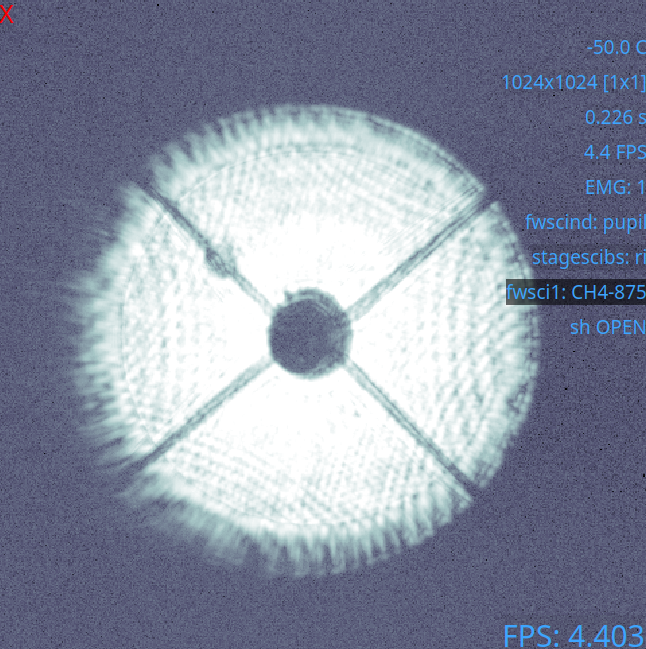
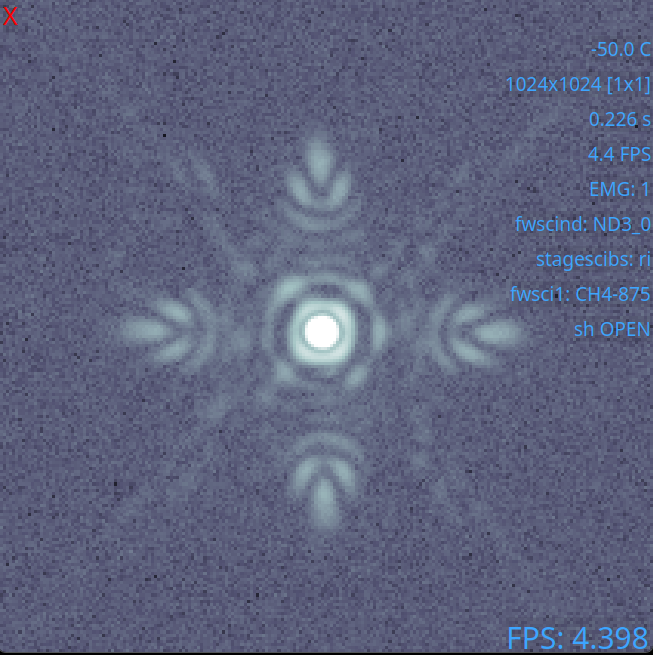
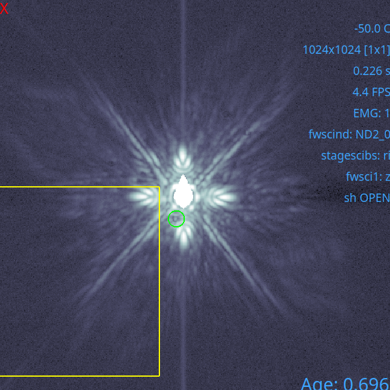
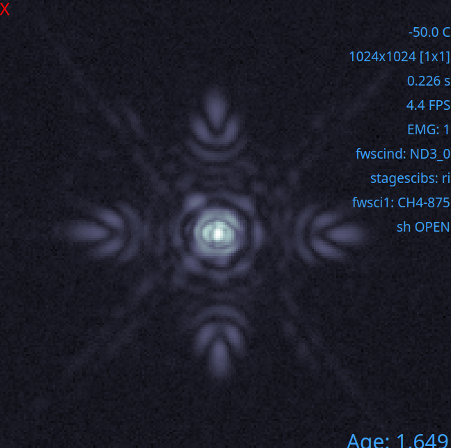
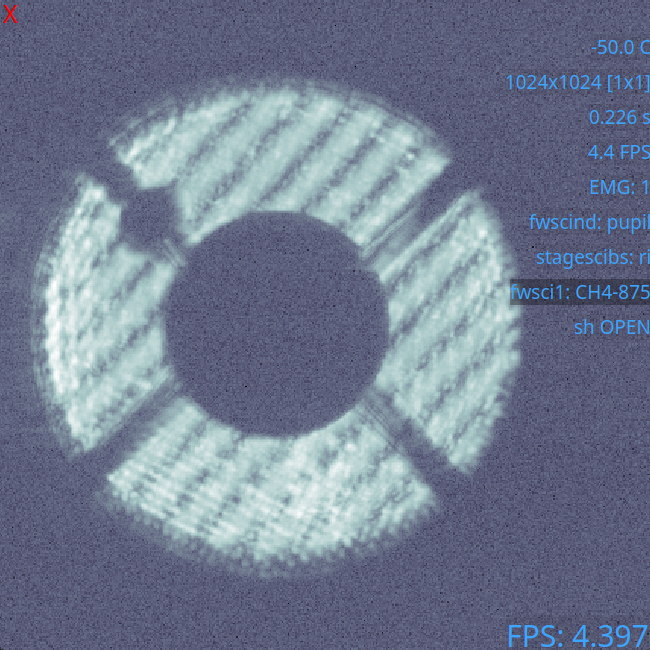

PIAACMC Alignment
--------------------------
This alignment procedure assumes you have already completely aligned the system and that FDPR has been run. If that is not the case, please return to the standard alignment page.

PIAA alignment has three major components, and will be aligned in these steps:
    #. Bump mask alignmnet
    #. **Forward PIAA lenses**
    #. **Complex focal plane mask alignment**
    #. Lyot stop alignment
    #. **Inverse PIAA lenses**

Bump mask & Forward PIAA Lenses
~~~~~~~~~~~~~~~~~~~~~~~~~~~~~~~~~~~~~~~
The first set of PIAA optics are the forward lenses. It is recommended that you use the ``pupilCorAlign`` to align the bump mask before you introduce the first set of PIAA lenses. To align the bump mask, see "Automated Bump Mask and Lyot Stop Alignment".
With the bump mask in, you are ready to align the forward PIAA lenses.

    - Stay in the pupil position on fwscind
    - Set the stagesci1 to 54.5 for best focus
    - Move `stagepiaa` to position 71.85
    - In the pupil position:
        - Look for symmetry in the pupil plane. The given position should be good enough, but fine alignment could be needed.
        - For alignment, move ``PIAA`` the conjoined lens control, in Coronagraph Alignment GUI
    - In the focal plane:
        - Put on narrow sparkles: separation 10 lambda/D, amp 0.05
        - Move ``PIAA1`` until pineapples are symmetric, see figure
        - This operation moves PIAA1 relative to PIAA0, recommendation is to only move PIAA1 because it has more degrees of freedom in the control GUI
        - Central PSF should be symmetric, the "tails" of the pineapples should point towards the center

.. note::
    The best position for stagepiaa has been seen to drift between MagAO-X setups. Double check this position between installs.

PIAACMC - aligning the coronagraph mask
~~~~~~~~~~~~~~~~~~~~~~~~~~~~~~~~~~~~~~~~~~~~~~~
Once you are satisfied with your alignment of the first set of lenses, you are ready to introduce the complex focal plane mask. There are multiple prints on the substrate, and you will need to find the correct one.
    - Select `cmc2` on fwfpm
    - Make sure camsci EMgain is set to 1
    - If using an ND filter, lower the ND to allow more light through
    - You should see multiple diagonal rows of small dots. See figure.
        - the top row are tests
        - the second row are good z' masks
        - the third and fourth rows don't work well
    - Find the spot on the second tilted row, third spot from the left, numbered in figure.
    - The spot should look centered on the PSF as shown below. See figure.
        - adjust ND as needed to see this properly

Lyot stop & Inverse PIAA Lenses
~~~~~~~~~~~~~~~~~~~~~~~~~~~~~~~~~~~~~~
Note that the addition of PIAA lenses means `pupilCorAlign` will no longer work as intended. The Lyot stop needs to aligned by hand, thankfully it is more forgiving than the bump mask.
    - Take a dark with the shutter open
    - Insert `RLyotPIAA` using the `fwpupil`
    - Align so that the mask is roughly centered on spiders
Next, we add in the inverse PIAA lenses.
    - Take the inverse PIAA stage to position 61.4
    - In the pupil position:
        - Again, look for symmetry. This position should be good enough but fine alignment could be needed.
        - For alignment, move with the ``iPIAA`` control, which moves the lenses together
        - Check to see that the iPIAA lenses have a centered distortion, see figure.
    - In the focal plane:
        - shift to the narrowband 875 filter for undispersed sparkles
        - Put on narrow 10 lambda/D sparkles
        - Move ``iPIAA1`` lens in the coronagraph GUI until sparkles are symmetric
            - like the forward PIAA it is recommended to just change the second lens, and leave alone ``iPIAA0``
        - Check closer (3 l/D) and further (20 l/D) sparkles to make sure alignment holds throughout the field
        - See figure for final alignment.

.. figure:: figures/PIAA_final.png
    :alt: Final focal plane image for an aligned PIAA
    :width: 50%
    :align: center

At this point you're ready to dig a dark hole.
