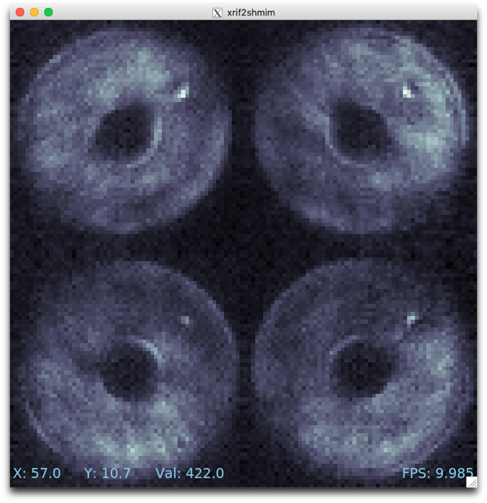

Running MagAO-X from Linux
==========================

As with everything in Linux, there are many ways to accomplish the same thing. 

If you have a dedicated MagAO-X computer, you can set it up with Rocky Linux and the "workstation" MagAO-X role, following the :doc:`../compute/computer_setup/computer_setup` doc.

If you want to keep MagAO-X separate from your other work, you still have two options.

Container
---------

On Linux, containers provide the highest-performance option, since they run directly on your operating system kernel (but "contained"). The setup scripts build all the MagAO-X tools and GUIs in a container on a regular basis, which you can "pull".

TODO how to start tunnels
TODO how to start GUIs

Multipass
---------

This section explains how to install MagAO-X in a virtual machine (VM). The VM can then be deleted and recreated as many times as you like without interfering with your host machine.

Configuring the virtual machine is done from the command line. Example commands are shown after a ``$`` or ``ubuntu@magao-x-vm:~$`` (which you don't type yourself as part of the command), and output is on un-prefixed lines.

You will want to first install Multipass, a virtual machine manager specifically for Ubuntu Linux VMs on Linux, Windows, and macOS computers. Follow the `instructions on their website <https://multipass.run/install>`_ to install.

Automated Creation
-------------------

After you have installed multipass, you can run `this script <https://gist.github.com/jaredmales/f7d9070ebc23e153966f03b8477102fc>`_ to attempt a fully automated setup and provisioning.  If that does not work, the below steps for manual provisioning will guide troubleshooting and recovery.

Manually Create the virtual machine
-----------------------------------

In a new terminal window, to create a VM with Ubuntu version 24.04::

   $ multipass launch -n magao-x-vm 24.04
   Launched: magao-x-vm

You should mount your home directory into the VM::

   $ multipass mount $HOME magao-x-vm:/home/ubuntu/Home

Next, verify you can connect to the VM and get a shell prompt::

   $ multipass shell magao-x-vm
   [... some lines omitted ...]
   ubuntu@magao-x-vm:~$

Notice that the shell prompt has changed to ``ubuntu@magao-x-vm:~$``. Commands within the VM will be prefixed with ``ubuntu@magao-x-vm:~$`` (though ``~`` may change), and "host" commands will continue to be prefixed with ``$``. Your home directory will be available inside the VM under ``~/Home``. This is one way to get files into and out of the VM. ::

   $ ls ~/Home
   [... list of all your files ...]

Now, exit the VM shell::

   ubuntu@magao-x-vm:~$ exit
   $

The first thing to do after creating the VM is to stop it (which is just like shutting down a "real" physical computer) and adjust some settings::

   $ multipass stop magao-x-vm
   $ multipass set local.magao-x-vm.disk=20GiB
   $ multipass set local.magao-x-vm.cpus=4
   $ multipass set local.magao-x-vm.memory=8G

This ensures you have enough space in the VM to install the MagAO-X software. (You can change the number of CPUs allocated to the VM to a number other than four if you want.)

Now, boot the virtual machine::

   $ multipass start magao-x-vm

You will see the message "Starting magao-x-vm" and a loading spinner. When the VM has started, you will be back at your host shell prompt. Wait a minute for the VM to start, then connect your terminal to the VM with::

   $ multipass shell magao-x-vm
   ubuntu@magao-x-vm:~$

Authentication Error
~~~~~~~~~~~~~~~~~~~~

Also, in the unlikely event you encounter this error (maybe upon reinstalling multipass)::

   Please use 'multipass authenticate' before proceeding.

this `forum post <https://discourse.ubuntu.com/t/unable-to-authorize-the-client-and-cannot-set-a-passphrase-workaround/28321>`_ explains recovery steps.

Resetting the VM
----------------

If you need to reset the VM, start by copying any data you need out of it (e.g. to ``~/Home``). Then, to **delete it forever**, use these commands::

   $ multipass stop magao-x-vm
   $ multipass delete magao-x-vm
   $ multipass purge

To recreate the VM, follow the instructions from the top of the page again.

Manually Install MagAO-X Software
-----------------------------------

Note: you do not need to do this if the automated creation script worked above.

Next, within the VM, obtain a copy of the MagAO-X software and install scripts. Using ``git`` we clone the MagAOX repository::

   ubuntu@magao-x-vm:~$ git clone --depth=1 https://github.com/magao-x/MagAOX.git
   Cloning into 'MagAOX'...
   remote: Enumerating objects: 1040, done.
   remote: Counting objects: 100% (1040/1040), done.
   remote: Compressing objects: 100% (907/907), done.
   remote: Total 1040 (delta 166), reused 642 (delta 100), pack-reused 0
   Receiving objects: 100% (1040/1040), 2.13 MiB | 1.04 MiB/s, done.
   Resolving deltas: 100% (166/166), done.

Go to the ``setup`` subdirectory::

   ubuntu@magao-x-vm:~$ cd MagAOX/setup/

Run the pre-provisioning script to establish the workstation role::

   ubuntu@magao-x-vm:~/MagAOX/setup$ MAGAOX_ROLE=workstation ./pre_provision.sh

You need to reload the ubuntu user's groups, so now logout::

   ubuntu@magao-x-vm:~/MagAOX/setup$ exit

And log back in::

   $ multipass shell magao-x-vm

You can now run the provisioning script::

   ubuntu@magao-x-vm:~/MagAOX/setup$ bash provision.sh

Now, wait a while. Don't be alarmed by the amount of output! Provisioning is very
noisy, and messages in red aren't necessarily errors. Successful
provisioning will end with the message

::

   Provisioning complete
   You now need to log out and back in for group changes to take effect

As the message says, you should exit the VM with ``exit``, and return to your host command prompt. Now, on to :ref:`vm_usage`.

What to do if you don't see ``Provisioning complete``
~~~~~~~~~~~~~~~~~~~~~~~~~~~~~~~~~~~~~~~~~~~~~~~~~~~~~

Most likely that means an error occurred running the provisioning
scripts and they did not finish. That can happen if a big download gets
interrupted, for example. It's always safe to run ``bash provision.sh``
again. It'll re-run only necessary steps, which may be enough to get you to
``Provisioning complete``.

If that doesn't resolve the issue, you'll need the complete provisioning
output to get help. The following command will save it to a file
``provision.log`` in your home folder on the host machine, which you can then email or Slack to someone who can help. ::

   ubuntu@magao-x-vm:~/MagAOX/setup$ bash provision.sh | tee ~/Home/provision.log

Usage
-----

Configuring the VM to connect
~~~~~~~~~~~~~~~~~~~~~~~~~~~~~

Before you can remotely control MagAO-X, a little post-provisioning
configuration is required. You must have a user account on MagAO-X with
an SSH key file configured. For the preconfigured tunnels to work, that key must not have a passphrase.

If you have a key pair in your computer's ``~/.ssh/`` folder, this appears at ``~/Home/.ssh/`` in the VM. (Note: RSA keys are not allowed.) Copy it into place::

   $ multipass shell magao-x-vm
   ubuntu@magao-x-vm:~$ cp ~/Home/.ssh/id_* ~/.ssh/
   ubuntu@magao-x-vm:~$ chmod u=r,g=,o= ~/.ssh/id_*

Next, you will need to edit the VM's ``~/.ssh/config`` file to add your username. Still within the VM, open a text editor::

   ubuntu@magao-x-vm:~$ nano ~/.ssh/config

At the end of the file, the line ``User YOURUSERNAME`` should be changed to reflect your MagAO-X username. Save and exit.

Connecting to the VM
^^^^^^^^^^^^^^^^^^^^

The rest of this section should be done within a VM except where otherwise noted.

Note: under some circumstances you will get a worrying-sounding message about ``Xauthority``. As long as things are working, it should be ignored.

Check connectivity to MagAO-X
^^^^^^^^^^^^^^^^^^^^^^^^^^^^^

To ensure everything's configured correctly, from a ``multipass shell``
session run ``ssh aoc``, verify your shell prompt changes to ``exao1``, then ``exit``::

   ubuntu@magao-x-vm:~$ ssh aoc
   [you@exao1] $ exit
   ubuntu@magao-x-vm:~$

Start tunnels
^^^^^^^^^^^^^

The ``xctrl`` script is installed during provisioning, and a default set
of apps is configured to run on ``xctrl startup``. These apps launch SSH
tunnels to the instrument.

The proclist for VM usage is in
`magao-x/config/proclist_vm.txt <https://github.com/magao-x/config/blob/master/proclist_vm.txt>`__.

Running ``xctrl startup`` to start the tunnels should result in output
like::

   ubuntu@magao-x-vm:~$ xctrl startup
   Session vm_aoc_milkzmq does not exist
   Session vm_aoc_indi does not exist
   Created tmux session for vm_aoc_milkzmq
   Created tmux session for vm_aoc_indi
   Executed in vm_aoc_milkzmq session: '/opt/MagAOX/bin/sshDigger -n vm_aoc_milkzmq'
   Executed in vm_aoc_indi session: '/opt/MagAOX/bin/sshDigger -n vm_aoc_indi'

And you can check their status with ``xctrl status``::

   ubuntu@magao-x-vm:~$ xctrl status
   vm_aoc_indi: running (pid: 6147)
   vm_aoc_milkzmq: running (pid: 6148)

(For the SSH tunnel apps, this can be misleading, as "running" doesn't necessarily mean "connected". That is why we checked that ``ssh aoc`` worked separately, above.)

Using GUIs in the VM
~~~~~~~~~~~~~~~~~~~~

The VM is configured to be “headless”, meaning there's no graphical display window. It is possible to run a virtual desktop with multipass, as `described in their docs for "Using RDP" <https://multipass.run/docs/set-up-a-graphical-interface#heading--using-rdp>`_. However, it's better to show MagAO-X software in windows that you can move around like other applications on your computer.

The way to do this is with X11 (the `next section <https://multipass.run/docs/set-up-a-graphical-interface#heading--using-x11-forwarding>`_ of their docs). Most Linux systems support X11 applications by default, but you will need to install `XQuartz <https://www.xquartz.org/>`__ on macOS, if you haven't already.

Windows users should consult the `Multipass docs <https://multipass.run/docs/set-up-a-graphical-interface#heading--x11-on-windows>`_ for their options. It appears that VcXsrv is the most up-to-date free option for a Windows X11 server, downloadable `here <https://github.com/marchaesen/vcxsrv/releases/download/21.1.10/vcxsrv-64.21.1.10.0.installer.exe>`_.

If you're unfamiliar with SSH X forwarding, the short version is that
the app runs on the VM but the window pops up like any other window on
your own computer (the host). SSH (i.e. ``multipass shell``) is the
transport that moves information about the window like mouse clicks and keypresses back and forth to the
GUI app, which lives inside the VM.

.. code:: text

   +------------------------------------------+
   |                  +----------------------+|
   |    Host OS       |          VM          ||
   |                  |                      ||
   |  [GUI window] <-SSH-> [MagAO-X GUI app] ||
   |                  +----------------------+|
   +------------------------------------------+

Assuming you have an SSH key on your host computer already, we need to teach multipass about it. Back on the host computer, we do::

   $ multipass exec magao-x-vm -- bash -c "echo `cat ~/.ssh/id_ed25519.pub` >> ~/.ssh/authorized_keys"

(Note the difference between the backtick quote and the straight single quote is important here.)

This adds the key as an authorized one for connecting to the VM. (We were connecting a different way when we did ``multipass shell`` earlier.)

The following incantation will connect a GUI-capable SSH session to your multipass VM and leave you at a VM prompt::

   $ ssh -Y ubuntu@$(multipass exec magao-x-vm -- hostname -I | awk '{ print $1 }' )
   ubuntu@magao-x-vm:~$

(If prompted with ``Are you sure you want to continue connecting (yes/no/[fingerprint])?`` just say ``yes``.)

So, to start the ``coronAlignGUI``, you could do...

::

   $ ssh -Y ubuntu@$(multipass exec magao-x-vm -- hostname -I | awk '{ print $1 }' )
   ubuntu@magao-x-vm:~$ coronAlignGUI

…and the coronagraph alignment GUI will come up like any other window on
your host machine.

Be careful! Anything you do with these GUIs **controls the real
instrument** (which is sort of the point, but it bears reiterating).

Viewing camera outputs
~~~~~~~~~~~~~~~~~~~~~~

The realtime image viewer ``rtimv`` is built during provisioning. To get
up-to-date imagery from the instrument, we can use
`jaredmales/milkzmq <https://github.com/jaredmales/milkzmq>`__, a set of
programs that relay shared memory image buffers from one computer to
another.

The AOC workstation runs a ``mzmqServer`` process that re-serves the
images it replicates from the rest of the instrument using compression
and a limit of 1 FPS. This ensures it doesn't overwhelm your home
internet connection.

(Napkin math: 1024 \* 1024 \* 16 bit, or one ``camsci1`` frame, is ~2
MB. 2 MByte / second is 16 Mbit / second, more than compressed HD video
streams. And that's just one camera!)

The list of images re-served by AOC is kept in
``/opt/MagAOX/config/mzmqServerAOC.conf`` (`view on
GitHub <https://github.com/magao-x/config/blob/master/mzmqServerAOC.conf>`__).

Establish a milkzmq connection for the cameras you want
^^^^^^^^^^^^^^^^^^^^^^^^^^^^^^^^^^^^^^^^^^^^^^^^^^^^^^^

After confirming the tunnel ``vm_aoc_milkzmq`` is running
(``xctrl status``), start a ``milkzmqClient``. For this example we'll
connect to ``camwfs`` and ``camwfs_dark``:

::

   ubuntu@magao-x-vm:~$ milkzmqClient -p 9000 localhost camwfs camwfs_dark &

(We've used ``&`` at the end of the command to background the client, so
just hit enter again to get a normal prompt back after its startup
messages.)

Launch rtimv
^^^^^^^^^^^^

The configuration in ``/opt/MagAOX/config`` includes ``rtimv`` config
files named for the various cameras (see the ``shmim_name`` options in
those files for hints about which images to replicate for a given
camera).

Start the viewer with

::

   ubuntu@magao-x-vm:~$ rtimv -c rtimv_camwfs.conf

and it should pop up a window like this:

   Example of rtimv viewer with 4 wavefront sensor pupils

For instructions on rtimv, consult its `user
guide <https://github.com/jaredmales/rtimv/blob/master/doc/UserGuide.md#rtimv>`__.
