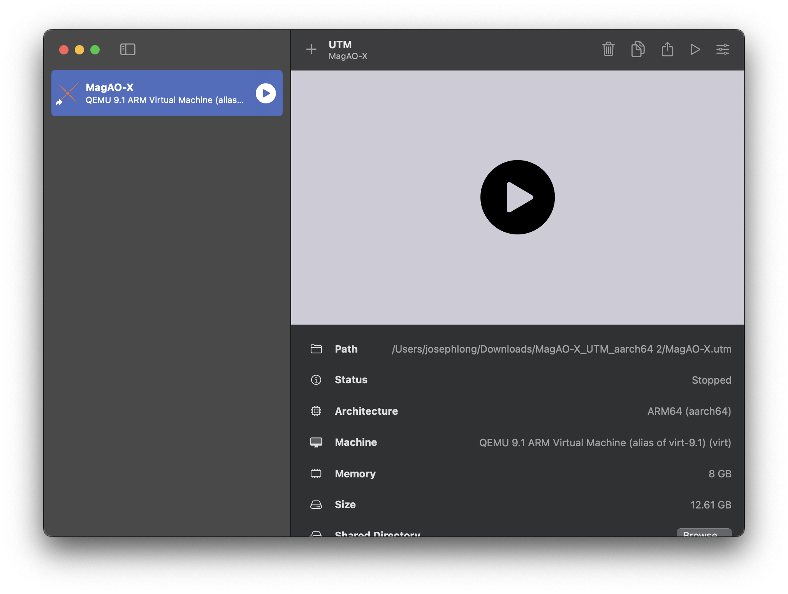
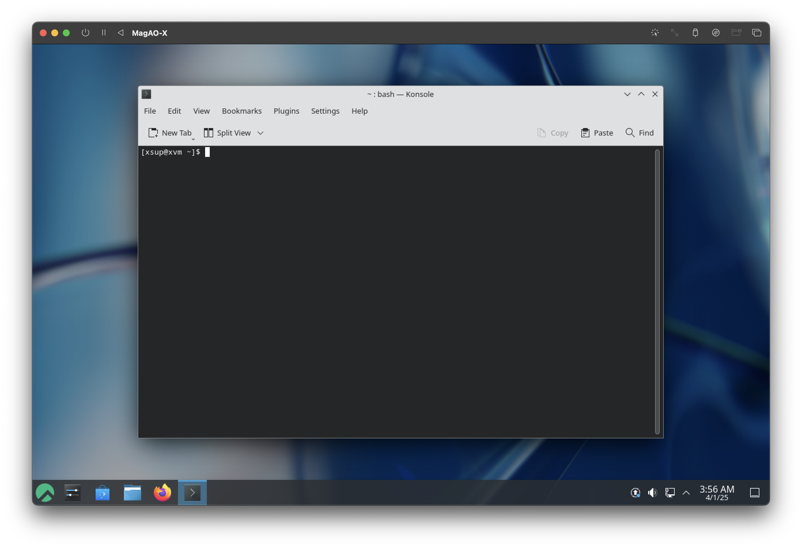

Running MagAO-X from macOS
==========================

Obtaining a copy of the MagAO-X software and virtual machine
------------------------------------------------------------

The MagAO-X setup scripts in https://github.com/joseph-long/magao-x-setup/ are used to generate a virtual machine image on a regular schedule. Get the latest built image from the repository's "Actions" tab.

   1. Go to the `list of successful build-vm runs <https://github.com/joseph-long/magao-x-setup/actions/workflows/build-vm.yml?query=is%3Asuccess>`_
   2. Click on the most recent build (i.e. the first one in the list)
   3. Scroll down to the "Artifacts"
   4. Choose the ``utm_bundle_aarch64`` artifact

      .. image:: build_artifacts.png
   5. When the download completes, extract the archive, giving you ``MagAO-X.utm``, ``xvm_key``, and ``xvm_key.pub``

Starting the virtual machine
----------------------------

On macOS, the virtual machine is packaged as a UTM bundle. Install UTM `from its website <https://mac.getutm.app/>`_ (free) or the `Mac App Store <https://apps.apple.com/us/app/utm-virtual-machines/id1538878817>`_ ($).

Move the MagAO-X VM bundle you downloaded out of your downloads folder and into a more permanent home. Double click it to open in UTM, and use the "play" button to start the virtual machine.

Once the machine is booted, you will have a Linux (KDE) desktop set up akin to a MagAO-X control computer.

Using the "pause" button in the toolbar will suspend the VM.

Install an SSH key
------------------

Connections to MagAO-X are secured with SSH keys. To connect from a virtual machine, you must have a key pair that is present within the virtual machine and installed on MagAO-X. How you do this is up to you, but one option is to copy the key pair you're using on your host computer (if it's already installed on MagAO-X).

You will need the IP address of the virtual machine. Use the system settings, or run this command *within the VM*::

   $ ip route
   default via 192.168.64.1 dev enp0s1 proto dhcp src 192.168.64.45 metric 100
   192.168.64.0/24 dev enp0s1 proto kernel scope link src 192.168.64.45 metric 100

In the above example ``192.168.64.45`` is the IP address on which the guest is visible to the host. Using this address (or whatever it happens to be for your setup), copy your SSH key into place. From *outside the VM*, go to the directory containing the VM bundle and a file called ``xvm_key``. Using this default key, connect to the VM::

   $ ssh -i ./xvm_key xsup@REPLACE_WITH_IP_ADDRESS

You may be prompted to accept/authorize the VM's SSH key with ``yes``. ::

   % ssh -i ./xvm_key xsup@192.168.64.45
   The authenticity of host '192.168.64.45 (192.168.64.45)' can't be established.
   ED25519 key fingerprint is SHA256:gSJgdHAWSK1GWQL/1GYswPg3to4Od3B/R1+yeSULYDs.
   This key is not known by any other names.
   Are you sure you want to continue connecting (yes/no/[fingerprint])? yes
   Warning: Permanently added '192.168.64.45' (ED25519) to the list of known hosts.
   xsup@192.168.64.45's password:
   [xsup@xvm ~]$

.. note::

   If you get a message like this::

      % ssh -i ./xvm_key xsup@192.168.64.45
      @@@@@@@@@@@@@@@@@@@@@@@@@@@@@@@@@@@@@@@@@@@@@@@@@@@@@@@@@@@
      @    WARNING: REMOTE HOST IDENTIFICATION HAS CHANGED!     @
      @@@@@@@@@@@@@@@@@@@@@@@@@@@@@@@@@@@@@@@@@@@@@@@@@@@@@@@@@@@
      IT IS POSSIBLE THAT SOMEONE IS DOING SOMETHING NASTY!
      Someone could be eavesdropping on you right now (man-in-the-middle attack)!
      It is also possible that a host key has just been changed.
      The fingerprint for the ED25519 key sent by the remote host is
      SHA256:gSJgdHAWSK1GWQL/1GYswPg3to4Od3B/R1+yeSULYDs.
      Please contact your system administrator.
      Add correct host key in /Users/user/.ssh/known_hosts to get rid of this message.
      Offending RSA key in /Users/user/.ssh/known_hosts:161
      Host key for 192.168.64.45 has changed and you have requested strict checking.
      Host key verification failed.
   
   You need to open ``~/.ssh/known_hosts`` and remove the offending key on the given line (here, line 161). Then, try the above steps again.

Using ``exit``, return to your host shell prompt::

   [xsup@xvm ~]$ exit
   $

Now you can copy your key into place. Let's assume you have an Ed25519 key saved in ``~/.ssh/id_ed25519``. From the host machine::

   $ scp -i ./xvm_key ~/.ssh/id_ed25519 xsup@REPLACE_WITH_IP_ADDRESS:.ssh/
   id_ed25519                                   100%  411   531.6KB/s   00:00

   $ scp -i ./xvm_key ~/.ssh/id_ed25519.pub xsup@REPLACE_WITH_IP_ADDRESS:.ssh/
   id_ed25519.pub                               100%  100   129.2KB/s   00:00

Configure your SSH username
---------------------------

The default contents of ``~/.ssh/config`` inside the VM are::

   Host aoc exao1
      HostName exao1.magao-x.org
   Host rtc exao2
      HostName rtc
   ProxyJump aoc
      Host icc exao3
   HostName icc
      ProxyJump aoc
   Host *
      User YOURMAGAOXUSERNAME

Edit this file in your favorite editor. As you might guess, ``YOURMAGAOXUSERNAME`` must be replaced with your MagAO-X username (the one used to log in to exao1/2/3).

Next, within the VM, test that you can connect to exao1/AOC::

   [xsup@xvm ~]$ ssh aoc
   [YOURMAGAOXUSERNAME@exao1]$ exit

Connect tunnels
---------------

The proclist for a workstation lives in ``/opt/MagAOX/config/proclist_workstation.txt``. It only has some SSH tunnels to start, which you can start with ``xctrl startup`` within the VM.

You can inspect the status of the tunnels by doing ``xctrl status``, which should show something like this::

   workstation_aoc_indi: running (pid: 1234)
   workstation_aoc_milkzmq: running (pid: 1235)

To test that INDI is actually connecting, ``getINDI`` from the command line will print all the (many) MagAO-X properties.

Connect viewer
--------------

To open camsci1, for example, open a terminal and type ``rtimv -c rtimv_camsci1.conf -Z -p 9000``.

.. image:: rtimv_in_vm.png

The ``rtimv`` command looks just like it does on the instrument, except for the ``-Z -p 9000`` options. These options have rtimv connect directly to the MilkZMQ relay, rather than requiring a local MilkZMQ client.

.. note::

   The "Age:" overlay in rtimv is unreliable when running remotely due to network congestion and clock synchronization issues. In other words, if images are always 3 seconds old, there is no technical issue with the viewer. You may have to wait that long to see your actions reflected, though.

.. warning::

   Every viewer open on anyone's remote workstation is receiving a high-bandwidth stream from the cameras. If the network connection gets saturated, you can get distorted or corrupted images. This doesn't indicate a hardware problem, and will go away if the network connection gets less congested.

   You may be able to help by closing viewers you aren't currently using.

Freeing GUIs from the virtual desktop
-------------------------------------

Since macOS and Linux both support X11, you can use the Linux GUIs from the virtual machine as if they were on your Mac. You will need XQuartz (https://www.xquartz.org/) installed.

Above, you identified the host IP address for your VM. Using that, connect via ``ssh`` using the ``-Y`` option for "trusted X11 forwarding". Remember to specify the xvm key::

   $ ssh -Y -i ./xvm_key xsup@REPLACE_WITH_IP_ADDRESS

At the resulting prompt, you can start a viewer with, e.g.::

   [xsup@xvm ~]$ rtimv -Z -p 9000 -c rtimv_camwfs.conf &

And a camera GUI, e.g.::

   [xsup@xvm ~]$ cameraGUI camwfs &

Now the MagAO-X GUI windows can behave like normal macOS windows (except that they all belong to the XQuartz application).

.. image:: rtimv_mac_x11.png

Updating the virtual machine
----------------------------

You will need to keep the virtual machine up-to-date. In general, this means updating the ``/opt/MagAOX/config`` repository and ``/opt/MagAOX/source/MagAOX`` codebase. If you know what needs to be updated, you can save time by updating those parts specifically.

If you don't know what needs to be updated, you have two options:

1. You can discard your existing VM **and any data saved on it**, or 
2. you can re-run provisioning.

If you choose Option 1, just delete the virtual machine and follow the above instructions again.

If you choose Option 2, connect to your virtual machine and open a terminal.

1. Update the setup scripts on the virtual machine::

      cd /opt/MagAOX/source/magao-x-setup/
      git pull

2. Repeat provisioning::

      bash provision.sh

This will repeat the installation steps with updated versions of the various MagAO-X software packages. In some cases there will be 

