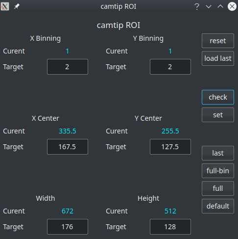
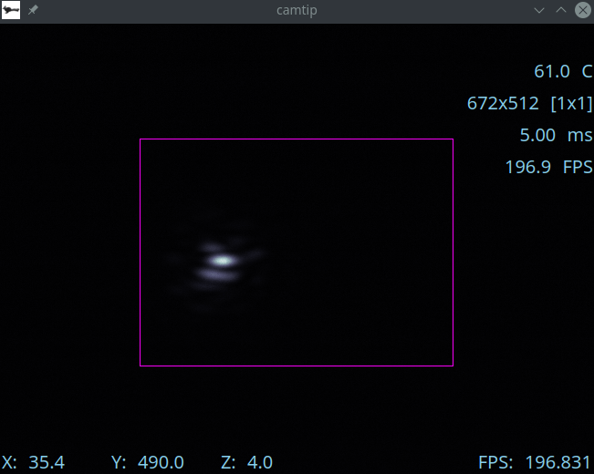

Cameras
=======

GUIs display images and control the cameras which produce them.

rtimv
------

Images can be displayed with ``rtimv``.  To get a fully featured ``rtimv`` session start it with the command 
::

      $ rtimv -c rtimv_camtip.conf

where ``rtimv_camtip.conf`` is a configuration file in the directory ``/opt/MagAOX/config`` for the camera ``camtip``.  The resultant ``rtimv`` window will look like:

|image2|

The text at the upper right shows information about the camera. The information presented depends on the camera and its capabilities.  The text at lower left shows the x/y coordinate of the mouse, and z means the value of the pixel under the mouse (after dark subtraction if enabled in ``rtimv``).  At lower right the FPS gage shows the measured frame-rate of the camera (it is not the rate at which rames are updating on your monitor).

In ``rtimv`` you can get help at any time by pressing the ``h`` key while in the window.

For the full description of all of the features of ``rtimv`` see the its `User Guide <https://github.com/jaredmales/rtimv/blob/master/doc/UserGuide.md#rtimv>`_.

ROIs
------

Regions of Interest (ROIs) can be set for many of the cameras used in MagAO-X.  The ``roiGUI`` can be started with the command
::

      $ roiGUI camtip
      
where ``camtip`` can be changed to the name of the camera device desired.

|image1|

The text entry blocks allow you to change the target parameters of the ROI.  When a target value is changed, the purple ROI box in rtimv (see above) will update automatically to show you which region of the camera is selected.  Note that you have to hit enter, or tab or click to another box, for the new value to load.

The button functions are:

1. **reset**: resets the target values to the current values. This does not change the camera settings.

2. **load last**: loads the last (previous) ROI into the target values, but does set them on the camera.  This does not change the camera settings.

3. **check**: requests that the camera software validate the target, and updates the values to the closest match allowable.  This does not change the camera settings.

4. **set**: requests that the camera change to the target ROI.  This **changes the camera settings.**

5. **last**: sets the last/previous ROI on the camera.  This **changes the camera settings.**

6. **full-bin**: sets the camera to the full size ROI preserving the current binning.  This **changes the camera settings.**

7. **full**: sets the camera to the full ROI in the smallest binning (usually 1x1).  This **changes the camera settings.**

8. **default**: sets the camera to the configured default ROI.  This **changes the camera settings.** 

