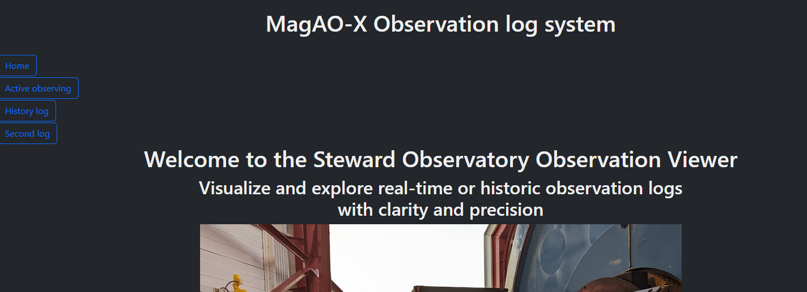
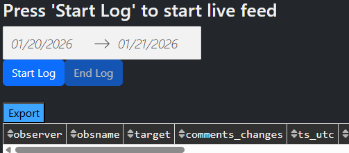
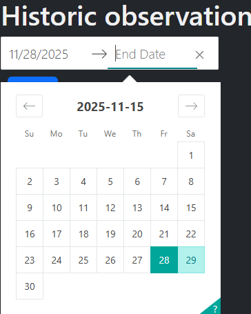
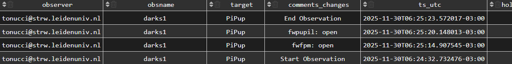
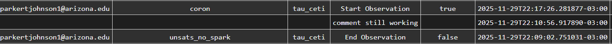

Observation Log App
*******************

This is an observation app that operates using a local Plotly web service running continuously on MagAO-X.

To open the user needs to navigate to 127.0.0.1:8050

The app will load directly to the homepage.

    

________________________________________

Choosing a Mode:
================
When the user opens the app and views the home page, there are three options: Home, Active observing, and History log. 
These three buttons are static and will be available on each page selected. Active observing is the only page that will automatically refresh during an observation period. 

All tables default to show newest to oldest based on the timestamp, and all tables can be easily exported by selecting the ‘Export’ button on the top left of the table as shown below.

________________________________________

Live Observation Mode:
======================
Use this during active observing from noon to noon. The date period is for reference only and cannot be manually changed. The dates will update automatically and at noon (1200) daily to accommodate a ‘new day’.

The user can initiate the log by pressing ‘Start log’, and ‘End log’ will stop the refresh cycle as shown above. The initial pull may be long if the log is refreshed deep into an observation, but it will dynamically speed up to prevent a bottleneck. 

What the log does:
------------------
* Listens for new telemetry and user logs and will update automatically
* Appends only the data that has changed and will append the column name (device) and value into the ‘comments_changes’ column for quick reference. 
* Tracks observation windows in real time

When to use:
------------
* During nighttime operations
* While configurations are changing
* When adding observer notes

*Do not refresh the page while live logging; always end the log.*

________________________________________

Historical Observation Mode:
==============================
Use this to review past observations. 
The user must manually select the time range that they want. The larger the time range, the longer it will take for the table to populate, as more data needs to be queried and filtered. 

As with the live log data, the table will be shown from newest to oldest. Historic observations also have the added benefit of being able to reverse the order by column, such as time, obsname, target, etc.  

What it does:

* Loads a fixed date range
* Reconstructs observation windows
* Displays telemetry changes and user logs
* Does not auto update

Observations crossing midnight are treated as continuous sessions.

________________________________________

Telemetry Behavior:
=====================
The app shows state changes only.  

* Unchanged values are suppressed
* Rapid changes appear as multiple entries
* Missing entries usually mean no change occurred
  
This keeps the log readable and useful. Below is an example:

________________________________________

User Logs:
==========
User logs are manual annotations using the ‘xlog’ function.

Use them to capture:

* Observer intent
* Reasons for changes
* Conditions or anomalies

User logs appear with their own row in comments_changes along with the timestamp at which it was recorded. 

________________________________________

Switching Modes:
================
Switching modes resets the session context.

Live → Historical:

* Stops live updates
* Clears live cache
* Loads historical data

Historical → Live:

* Initializes a new live session
* Only new data is processed. If switching to live view during observation, the first load may take a moment to populate, depending on the amount of data needing to be filtered.

Do not switch modes mid-analysis unless you intend to reset the view.

________________________________________

Common Mistakes:
================

* Mistake: Refreshing to get updates

    Fix: Use live mode

* Mistake: Interpreting repeated start markers as real restarts

    Fix: Usually a backend issue in ‘observation_log.py’ or ‘active_observing.py’

* Mistake: No telemetry is being displayed in the table or telemetry stopped updating

    Fix: Stop / Start observation. If the table does not refresh and continue with new telemetry, dbIngest may need to be restarted.
