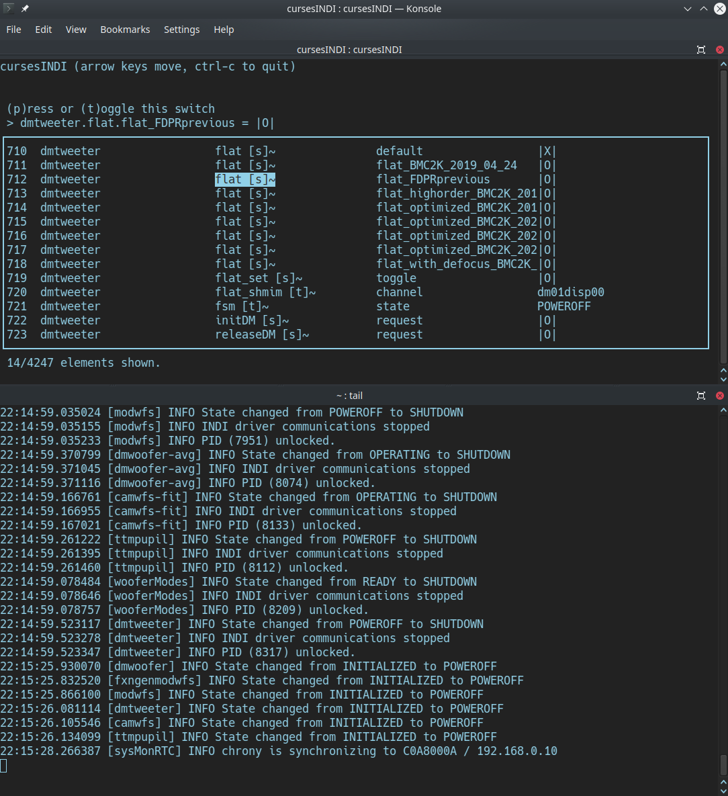

cursesINDI
==========

The instrument interface of first and last resort.

The ``cursesINDI`` tool is available on all MagAO-X computers (including
VMs and the test bed) and enables viewing and manipulation of the
instrument settings via low-level properties and the INDI protocol. It
can be useful when adding new drivers to the system, or when trying to
track down a strange behavior in a higher-level GUI interface.

You do not need to be ``xsup`` to run ``cursesINDI``, but you do need
``localhost:7624`` to connect to a local or remote indiserver. This is
the case when SSHed in to AOC, RTC, ICC, or the testbed (TCC);
otherwise, you can use SSH tunneling.

Overview
--------

Start cursesINDI from a terminal with the ``cursesINDI`` command.

   screenshot of a terminal showing cursesINDI in action

The terminal will blank and show something like the top pane in the
screenshot above. Note: that you may need to resize your terminal to see
all five columns:

-  index
-  device name
-  property name (and meta info, see below)
-  element name (see conventions below)
-  value

By default, you’re in “search” mode. Start typing a device name and
cursesINDI will scroll the list to bring that device into view.
Right-arrow over to the value column, and the ``search:`` prompt will
change to ``(e)dit this number``. Hit the ``e`` key and you’ll be
prompted to ``set devname.propname.element=``. Type in your new value,
hit ``enter``, and confirm (after checking carefully) the new value with
``y``. (Or, you can hit ``Esc`` to get out of setting the value.)

Note that many properties are read-only, and you will not be offered to
edit them if so.

``cursesINDI`` also shows you the current value of the element you have
selected as ``set devname.propname.element = <value>``. Text and numbers
are displayed as transmitted by INDI. Switches use ``|O|`` for off and
``|X|`` for on.

Property meta info
------------------

The bracketed letter indicates whether a property is a ``[t]ext``,
``[n]umber``, ``[s]witch``, or ``[l]ight`` as defined by INDI. The
character after the brackets can be ``~`` (Idle), ``-`` (Ok), ``*``
(Busy), or ``!`` (Alert). You’ll see Idle properties switch to Busy when
you set them, and back to Idle once the state you’ve set has been
reached.

Element naming convention
-------------------------

In the MagAO-X instrument, the convention is for settable properties to
expose their ``current`` value and their ``target`` value as two
elements of the property. This is useful to, e.g., command stages and
compare their current location to their commanded one. (Thanks to
limitations in INDI, “read-only” can only apply to properties, not
elements. Functionally, ``current`` is read-only and all edits are to
``target``.)

Process Logs
------------

All process logs for INDI-connected MagAO-X applications are streamed to
INDI clients. ``cursesINDI`` writes these as they are received to the
file ``/tmp/cursesINDI_logs.txt``. You can monitor these logs in
real-time with the command

::

   $ tail -f /tmp/cursesINDI_logs.txt

The result is shown in the bottom pane of the above screenshot. Most
terminal programs allow you to split the screen, making for a nice
combined system control panel with the logs on the bottom. The image
above shows this.

The ``cursesINDI`` log file will only contain up to 1000 entries, at
which point is emptied and restarted. For more detailed inspection of a
processes history you must use the ``logdump`` utility.
