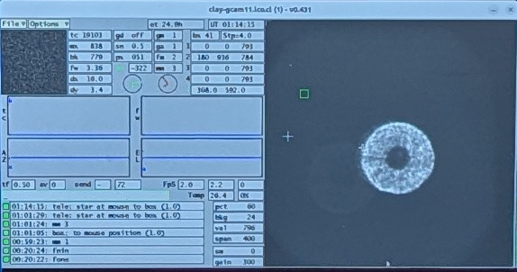

Star Hopping
===================================
Star Hopping can be used to efficiently  switch between a science target and a Point Spread Function (PSF) reference.
Data acquired in such fashion can be used for Reference Differential Imaging (RDI) PSF subtraction.  Proficient operators, working
as a team with the TO, can switch targets in less
than 50 seconds (as measured by time between when data saving stops and subsequently re-starts).

Your main target (i.e. the one with the disk, etc) and the PSF should both be in your catalog.  The closer your PSF is to the main target,
the more efficient you will be.  Typically less than 1 degree is the goal. The PSF star should be single. The goal is to match AO performance, so try to match star brightness closely.
Color between the WFS bandpass and your observing bands may also be of interest. Consult your local
AO observing shaman for further guidance on how to choose your PSF .

Guider System Setup
-----------------------------------
On the first observation of the first target:

    - open the AO loop
    - ask the TO to insert the guider probe
    - the image of the star will essentially be a pupil, given the large focus offset of MagAO-x
    - The TO will mark the center of the image (in the central obcuration) with the green box.
    - Now slew to the next target and follow the following steps for subsequent switches.

Switching Targets
-----------------------------
On subsequent switches:

    - Give the TO at least 30 seconds notice that you are about to switch and identify the new target in the catalog.  The TO will prepare to slew.
    - When ready, stop saving, open the HO and LO loop, and ask the TO to move.  These should be simultaneous -- you can tell the TO it's time when you start opening the loop rather than after it's open.
    - The TO should put the probe in while slewing.
    - Take a WFS dark and insert ``flipacq`` while slewing.  Be sure to open the shutter on ``camwfs`` after the dark!
    - The star will show up on the gcam in the center position, again as a pupil image.  The TO will then move the image to be centered on the green box.  Do not focus the guider!
    - As soon as the star is visible on ``camacq``, use the ``move telescope`` buttons to move it to the pyramid. You do not need to wait until the probe is stowed.
    - Remove ``flipacq``.
    - Close the HO loop.  The star will now be behind the coronagraph.
    - Now close the LO loop.
    - Begin saving data.

    The Clay guider camera image upon acquisition of a star when in the MagAO-X focus position.  The green box marks the position for MagAO-X (it corresponds to the tip of the pyramid, and therefore the coronagraph mask).

.. figure:: figures/gcam_starhop_magaox_pos.jpg
    :alt: Clay guider camera image of a star in position for MagAO-X
    :width: 75%
    :align: center

    The Clay guider camera image after the telescope has been moved to place the star on the MagAO-X pyramid.
