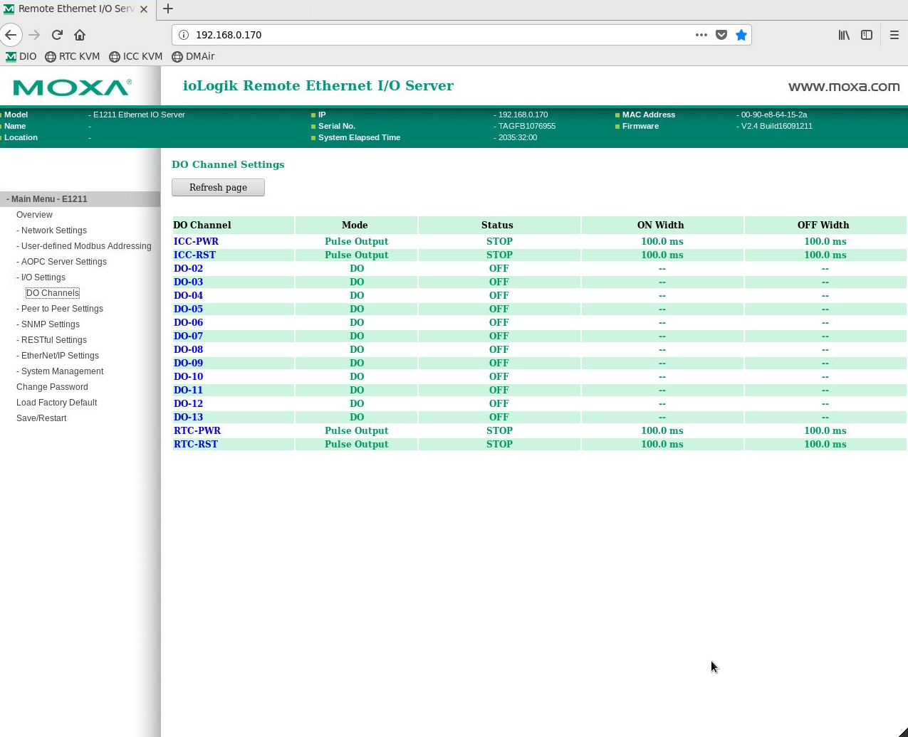
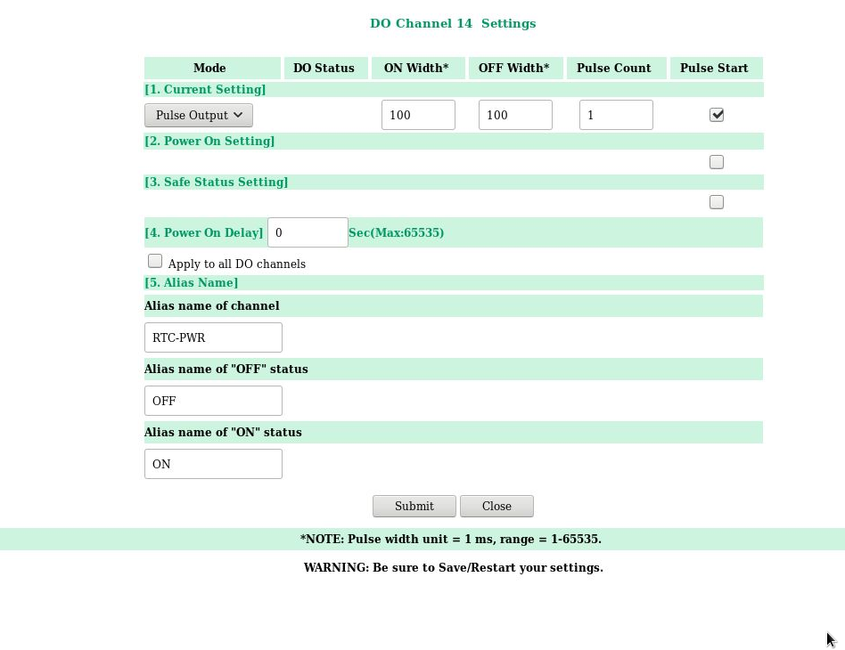
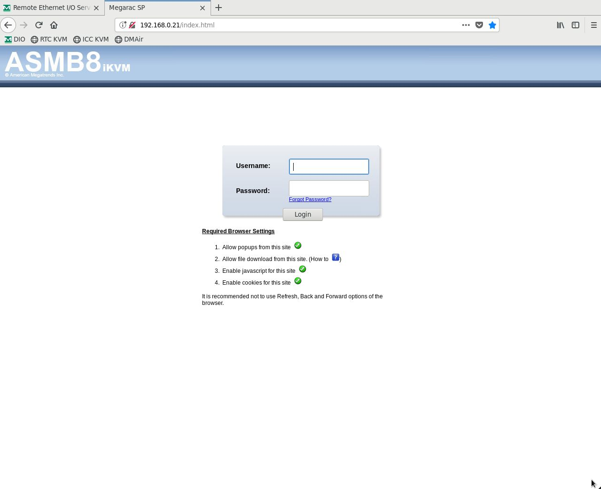
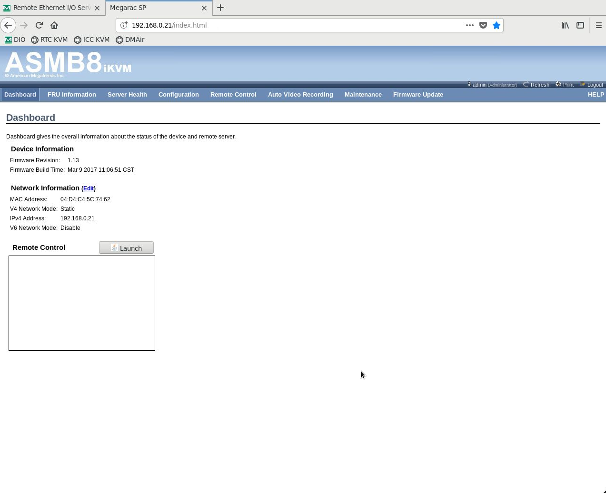
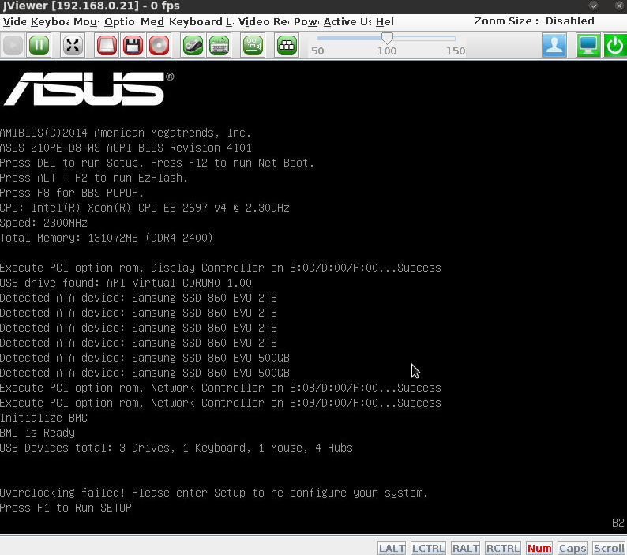

System Startup
===============

Once the instrument has been unpacked and cabled, begin startup from
System Powerup. Subsequent (nightly/daily) re-startup should generally
begin from “Preparing For Operation” below.

The following assumes you're sitting at the AOC workstation, but it
could be done anywhere with appropriate network tunnels. When one must
SSH to different hosts, the one where the command should be run will be
indicated before the prompt, like ``[xsup@exao1 ~]$ ls`` to run ``ls``
on AOC in the ``~`` directory. (Don't type the ``[host $]`` prompt, or
any comment lines starting with ``#``.)

You should run these commands as the user ``xsup`` to ensure you can
read shared memory images (shmims) and ``ssh`` around to RTC and ICC. If
sitting at AOC, it's therefore best to be logged into the desktop as
``xsup``.

If working remotely, note that steps in RTC and ICC power-up must be
done from firefox running on AOC. You can use ``ssh -X`` to accomplish
this with the right command line option in firefox, but using the x2go
virtual desktop is generally easier.

System Powerup
--------------

1. Start the MagAO-X processes on AOC (exao1) to get power control (see
   the `guide to xctrl <./software/utils/xctrl>`__ for more detail)

   ::

      [xsup@exao1 ~]$ xctrl startup
      # you'll see some output as the processes start, wait a little bit
      [xsup@exao1 ~]$ xctrl status
      # verify processes are all green/running

2. You should have power control now. AOC talks over the instrument
   internal LAN to network-controlled power strips (PDUs), which you can
   control over INDI via several different interfaces: ``sup``,
   ``cursesINDI``, or ``pwrGUI``.

   Since you're sitting at AOC, it's simplest to open ``pwrGUI``. You
   should see switches appear.

   ::

      [xsup@exao1 ~]$ pwrGUI &
      # window should pop open with switches

3. The following devices should be powered up, and never powered off
   (unless you know what you're doing):

   -  swinst -- should already be on
   -  instcool -- have someone watching for flow (and leaks) before toggling!
   -  dcpwr
   -  blower
   -  fanmain
   -  fanaux

4. RTC Power-On

   #.  **CRITICAL** ensure that instcool is powered on to provide
       liquid cooling to the RTC.
   #.  using the pwrGUI, power on ``comprtc``
   #.  open firefox, and navigate to ``192.168.0.170`` (or use the "Moxa DIO" bookmark)
   #.  login (if required, password provided to those who need it)
   #.  in the left menu, select ``I/O Setting -> DO Channels`` |image1|
   #.  in the main frame, click on ``RTC-PWR``, which will open a new
       window: |image2|
   #.  Under [1. Current Setting], ensure that ``Pulse Output`` is
       selected, and check the box under Pulse Start. Then press the
       ``Submit`` button at the bottom. This remotely presses the ATX
       power button on the RTC.
   #.  Wait for it to come up, and you can ssh in. (You should not need to babysit it over the KVM.)

5. ICC Power-On

   #.  **CRITICAL** ensure that instcool is powered on to provide
       liquid cooling to the ICCC.
   #.  using the pwrGUI, power on ``compicc``
   #.  **IMPORTANT** wait at least 90 sec to allow the motherboard KVM module to
       initialize
   #.  open firefox, and navigate to ``192.168.0.170`` (or use the "Moxa DIO" bookmark)
   #.  login (if required, password provided to those who need it)
   #.  in the left menu, select ``I/O Setting -> DO Channels`` |image1|
   #.  in the main frame, click on ``ICC-PWR``, which will open a new
       window: |image2|
   #.  Under [1. Current Setting], ensure that ``Pulse Output`` is
       selected, and check the box under Pulse Start. Then press the
       ``Submit`` button at the bottom. This remotely presses the ATX
       power button on the RTC.
   #.  **IMPORTANT** Immediately on AOC as xsup in home, run the command:

       ::

          [xsup@exao1 ~]$ ./jviewer-starter/jviewer-starter 192.168.0.21 &

       Note that if you do not do this right away, the iKVM module will not register as a keyboard.
   #.  This brings up a video display of the ICC VGA output. Use the
       display to monitor progress. It will sometimes hang with a message
       to press F1 as shown: |image5|
   #.  This message is meaningless. When this message appears, press F1.
       Do NOT alter any settings. Immediately press F10 (Save Changes
       and Reset) and hit enter to say Yes. A soft keyboard can be
       brought up from the display controls to facilitate these
       interactions: |image6|
   #.  Without fail, ICC will lose a GPU, and shortly after, it will lock up. Just run ``watch nvidia-smi`` or something and wait until this happens.
   #.  When it locks up, use the iKVM interface's power button to power off (not reset) ICC remotely.
   #.  Power it up as before, and it should be fine from then on. (Although sometimes you have to do this dance twice.)
   #.  Once the boot finishes, use ``nvidia-smi`` in a terminal on ICC to be sure all GPUs
       are visible (currently two 2080Tis on ICC).
   #.  If a GPU has ``fallen off the bus``, see :ref:`the troubleshooting guide <missing_gpu>` for steps to take.

Software Startup
----------------

1. RTC

   -  ssh to RTC with ``ssh rtc``

   -  First start cacao processes. This is done with a startup script in the cacao directory:

      ::

         [xsup@exao2 ~]$ cd /opt/MagAOX/cacao
         [xsup@exao2 cacao]$ bash ./startup

   -  Use ``milk-fpsCTRL`` to verify that both ``dmch2disp-00`` and ``dmch2disp-01`` are running:

   -  Now start MagAO-X

      ::

         [xsup@exao2 ~]$ xctrl startup

   -  Use ``xctrl status`` to verify that processes have started.

2. ICC

   -  First start cacao processes. This is done with a startup script in the cacao directory:

      ::

         [xsup@exao3 ~]$ cd /opt/MagAOX/cacao
         [xsup@exao3 cacao]$ bash ./startup

   -  Use ``milk-fpsCTRL`` to verify that ``dmch2disp-02`` is running:

   -  Now start MagAO-X

      ::

         [xsup@exao3 ~]$ xctrl startup

   -  Use ``xctrl status`` to verify that processes have started.

3. It is possible that MagAO-X software startup will not complete
   correctly, and/or need to be re-done. Symptoms include not seeing
   either RTC or ICC (or both) processes in INDI on AOC, or crashed
   xindiserver processes (isICC or isRTC). The cause is elusive. The fix
   is to shutdown and restart MagAO-X software (``xctrl shutdown --all``) on
   each machine – possibly also on AOC. You do not need to shutdown the
   cacao processes.

GUI Setup
---------

To setup the GUIs on exao1 (AOC) as user ``xsup``, run the command:

   ::

      [xsup@exao1 ~]$ magaox_guis.sh

Some windows will need to be rearranged.  The DM displays should self-normalize.  If they do not, the following command should fix it:

   ::

      [xsup@exao1 ~]$ bash dmnorm.sh tweeter &

where you replace `tweeter` with either `woofer` or `ncpc` as necessary.

.. |image6| image:: rtc_save_and_exit_yes.png
