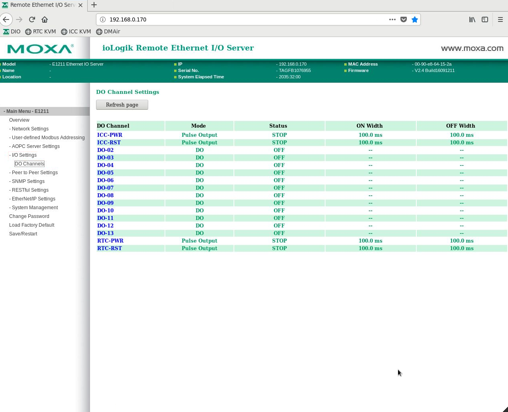
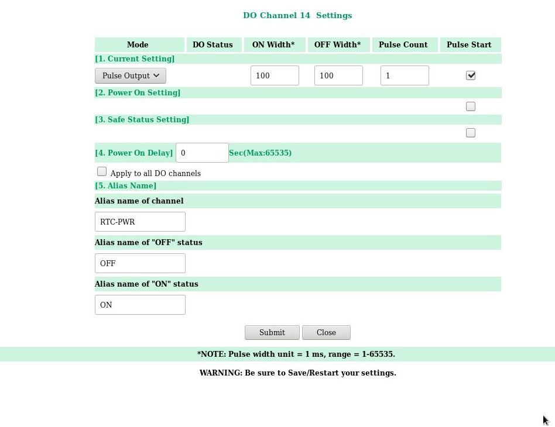

System Startup
===============

Once the instrument has been unpacked and cabled, begin startup from
System Powerup. Subsequent (nightly/daily) re-startup should generally
begin from “Preparing For Operation” below.

The following assumes you're sitting at the AOC workstation, but it
could be done anywhere with appropriate network tunnels. When one must
SSH to different hosts, the one where the command should be run will be
indicated before the prompt, like ``[xsup@exao1 ~]$ ls`` to run ``ls``
on AOC in the ``~`` directory. (Don't type the ``[host $]`` prompt, or
any comment lines starting with ``#``.)

You should run these commands as the user ``xsup`` to ensure you can
read shared memory images (shmims) and ``ssh`` around to RTC and ICC. If
sitting at AOC, it's therefore best to be logged into the desktop as
``xsup``.

If working remotely, note that steps in RTC and ICC power-up must be
done from firefox running on AOC. You can use ``ssh -X`` to accomplish
this with the right command line option in firefox, but using the x2go
virtual desktop is generally easier.

System Powerup
--------------

1. Start the MagAO-X processes on AOC (exao1) to get power control (see
   the `guide to xctrl <./software/utils/xctrl>`__ for more detail)

   ::

      [xsup@exao1 ~]$ xctrl startup
      # you'll see some output as the processes start, wait a little bit
      [xsup@exao1 ~]$ xctrl status
      # verify processes are all green/running

2. You should have power control now. AOC talks over the instrument
   internal LAN to network-controlled power strips (PDUs), which you can
   control over INDI via several different interfaces: **sup**,
   **cursesINDI**, or **pwrGUI**.

   Since you're sitting at AOC, it's simplest to open **pwrGUI**. You
   should see switches appear.

   ::

      [xsup@exao1 ~]$ pwrGUI &
      # window should pop open with switches

3. The following devices on the *ninja* tab of **pwrGUI** should be powered up, and *never* powered off
   (unless you know what you're doing):

   -  ``pdu0.dcpwr``
   -  ``pdu3.blower``
   -  ``pdu3.rackfans``
   -  ``pdu3.instCool``
   -  ``usbdu0.rhtweeter``
   -  ``usbdu1.rhncpc``

   The ``camflowfs`` and ``camllowfs`` power should also be turned **on** (at least long enough to follow the ICC Power-On steps below).

4. RTC Power-On

   #.  **Critical:** Ensure that ``instCool`` is powered on to provide liquid cooling to the RTC.
   #.  Using the **pwrGUI** *ninja* tab, power on ``pdu0.comprtc``
   #.  Using Firefox on AOC, navigate to http://192.168.0.170/ (or use the "Moxa DIO" bookmark)
   #.  Log in (if required); password provided to those who need it
   #.  In the left menu, select :menuselection:`I/O Setting --> DO Channels` |image1|
   #.  In the main frame, click on :guilabel:`RTC-PWR`, which will open a new window: |image2|
   #.  Under :guilabel:`1. Current Setting`, ensure that :guilabel:`Pulse Output` is
       selected, and check the box under Pulse Start. Then press the
       :guilabel:`Submit` button at the bottom. This remotely presses the ATX
       power button on the RTC.
   #.  Wait for RTC to come up, and verify that you can ssh in

.. note::

   If connecting from off-site, you can set up a tunnel to the Moxa DIO device by running::

         ssh -L8787:192.168.0.170:80 YOURUSERNAME@exao1.magao-x.org

   (substituting your MagAO-X username appropriately). The interface is then available at http://localhost:8787/

5. ICC Power-On

   #.  **Critical:** Ensure that ``instCool`` is powered on to provide liquid cooling to the ICC.
   #.  Using the **pwrGUI** *ninja* tab, power on ``pdu0.compicc``
   #.  Using Firefox on AOC, navigate to http://192.168.0.170/ (or use the "Moxa DIO" bookmark)
   #.  Log in (if required); password provided to those who need it
   #.  In the left menu, select :menuselection:`I/O Setting --> DO Channels`
   #.  In the main frame, click on :guilabel:`ICC-PWR`, which will open a new
       window similar to the one for RTC-PWR.
   #.  Under :guilabel:`1. Current Setting`, ensure that :guilabel:`Pulse Output` is
       selected, and check the box under Pulse Start. Then press the
       :guilabel:`Submit` button at the bottom. This remotely presses the ATX
       power button on the ICC.
   #.  Wait for it to come up, and verify you can ssh in
   #.  Ensure the LOWFS camera driver loads by running ``sudo modprobe pvcam_pcie`` (we plan to automate this eventually, but it's always safe to do again)
   #. **Optional:** If you don't plan to use the LOWFS cameras any time soon, you can power them back off. See :ref:`missing_lowfs` for hot-plugging instructions if you need to power them on later.

.. _cacao_cold_startup:

Fresh reboot CACAO startup
------------------------

RTC (exao2)
~~~~~~~~~~~

Connect to RTC as xsup (i.e. ``ssh rtc`` if you're logged in as ``xsup`` at the operator workstation).

Start the CACAO processes::

   [xsup@exao2] $ cacao-startup

Success looks like ``SCRIPT /usr/local/milk/bin/cacao-setup  Success`` after many screenfuls of text.

Use ``milk-fpsCTRL`` to verify that both ``dmch2disp-00`` and ``dmch2disp-01`` are running.
The second column of numbers (color-coded red or green) indicate the number of errors. If red (i.e. > 0 errors),
the processes won't start and the errors should be examined.

ICC (exao3)
~~~~~~~~~~~

Connect to RTC as xsup (i.e. ``ssh rtc`` if you're logged in as ``xsup`` at the operator workstation).

Start the CACAO processes::

   [xsup@exao2] $ cacao-startup

Success looks like ``SCRIPT /usr/local/milk/bin/cacao-setup  Success`` after many screenfuls of text.

Use ``milk-fpsCTRL`` on ICC to verify that ``dmch2disp-02`` is running.

Fresh reboot MagAO-X startup
----------------------------

You already started MagAO-X software on AOC (exao1) to control power, but the hardware control processes on RTC (exao2) and ICC (exao3) have to be started.

Connect to RTC as xsup (i.e. ``ssh rtc`` from the operator workstation) and run ``xctrl startup``.

After it completes, use ``xctrl status`` to verify that processes have started (i.e. are ``running`` and not ``dead``).

Repeat these steps on ICC (``ssh icc``, ``xctrl startup``, ``xctrl status``).

Investigate any processes that failed to start by using ``logdump -n 1 {name}`` to see the log and/or ``tmux a -t {name}`` to connect to their tmux session.

GUI Setup
---------

- To setup the GUIs on exao1 (AOC) as user ``xsup``, run the command:

   ::

      [xsup@exao1 ~]$ magaox_guis.sh

- Some windows will need to be rearranged.  The DM displays should self-normalize.  If they do not, the following command should fix it:

   ::

      [xsup@exao1 ~]$ bash dmnorm.sh tweeter &

where you replace `tweeter` with either `woofer` or `ncpc` as necessary.

- Set up a :doc:`cursesINDI <./software/guis/cursesINDI>` terminal.

Preparing for Operations
-------------------------

You can now proceed to :doc:`daily_startup` to prepare the instrument for operation.

