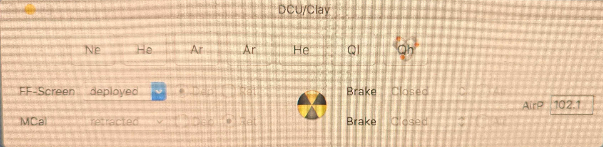

Taking Flats
===================================
Flats can be taken when MagAO-X is on the telescope, using either the flat-field screen or using the twilight sky.  ``stageff`` deploys a field stop 
which is just slightly smaller than the ``camsc1/2`` FOV in order to produce an accurate flat.

The telescope will need to have the mirror covers open.  If using the sky the dome will need to be open and the sky relatively bright,
i.e. shortly after sunset.  Talk to your awesome TO to make sure they know you want to do this.

See below for flat-field screen use.

Configuring MagAO-X
-----------------------------------

    - place MagAO-X in lab mode
    - place ``stagepickoff`` in the ``tel`` position
    - the DMs should have flats set, but otherwise the alignment and wavefront quality is unimportant
    - power on ``stageff``, and place it in the ``in`` position (use `stageGUI stageff`)
    - configure ``stagescibs``, ``fwsci1`` and ``fwsci2`` as needed
    - open shutters on ``camsci1`` and ``camsci2``, adjust exposure time and/or EM gain until you see light
    - now adjust the position of ``stageff`` until the left edge of the field stop is on the left edge of ``camsci1``
    - you may need to ask a MagAO-X ninja to manually adjust the y-position of the mask to center it on ``camsci1``
    - adjust exposure time to maximize counts without saturating
    - take data
    - take darks

Using the Flat-Field Screen
------------------------------------

The flat-field screen is installed on the secondary truss, and deploys in front of M2.  It can then be illuminated with a selection of lamps.

    - Arrange to have the mirror covers open.  Upon request the TO will re-open them after stowing the telescope for the day.
    - On the observer computer, there is small gui (shown below).  Select ``Deploy`` in the FF-Screen drop down
    - Walk out into the dome and verify it is in.
    - Once it is in, select the lamp by pressing its button.  We normally use ``Qh`` for maximum flux, but ``Ne`` is pretty.
    - Set up MagAO-X and take data as above.
    - When you are done, turn off the lamp and retract the screen.
    - The mirror covers will be closed by the day crew.  Go to bed.

    The flat-field screen operation gui.  This shows the screen deployed  and the ``Qh`` lamp on.

