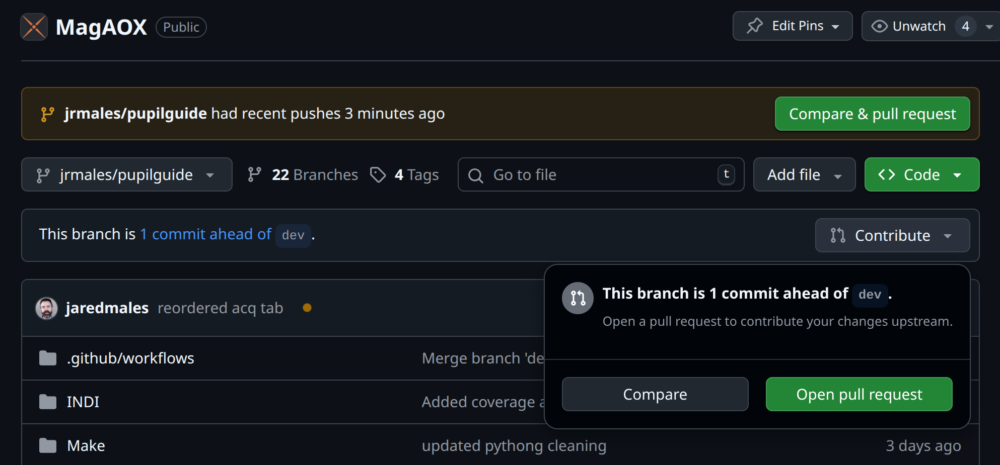
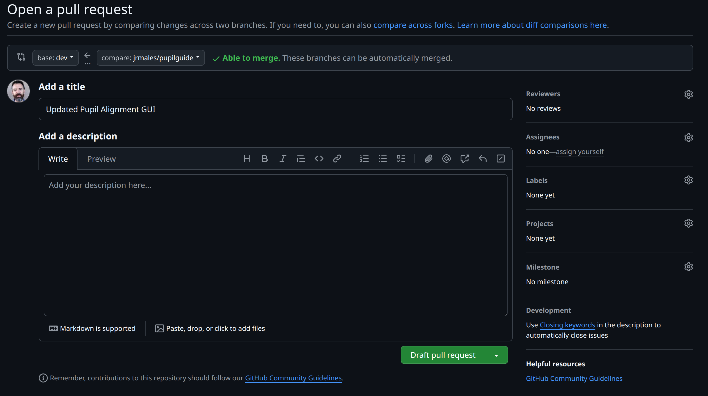

Development of MagAO-X Software
======================================

Version Control Policy
------------------------

On-sky telescope time is extremely precious.  To ensure that we take full advantage of the limited time allocated for MagAO-X, we adhere to the following rules:

  - Any code run on the MagAO-X instrument, which includes configuration files,
    when observing a star (as opposed to the internal source) must be under
    version control, with the current in-use version committed and pushed to a remote repository (i.e. github).
  - Any software run on the MagAO-X instrument when observing a star must record its version control status,
    i.e. git commit hash and branch, in a way that can be correlated with any recorded data.
  - Exceptions for debugging during testing will be rare.  This is an experimental system, and, with few exceptions, nothing works on-sky the way
    it does in the lab.  As such, we will often need to debug software while testing it on-sky.  While not following the above rules may seem expedient,
    there are few cases where it is not possible to commit your code before testing it, even when on-sky. Commit your code.
  - When on the internal source, especially when taking data for later analysis, the above rules should be followed in
    almost all cases.  The only exceptions are for pure software testing when on the internal source, i.e. "does this crash still?".
    If there is any chance you will publish the data, you must commit your code!

Adherence to these rules ensures that experiments and observations with MagAO-X are fully documented and reproducible (subject
to turbulence, as always).

Paths and Where to Edit Code
------------------------------

The current source code for the software used to run MagAO-X is maintained in

::

   /opt/MagAOX/source

In general, you should not edit code directly there.  Only user `xdev` should interact with these repos,
including `git pull` and building and installing.

Individual developers will maintain their own copy of any repositories they are editing under their home directory in
accordance with the below instructions.

The executables are installed to

::

   /opt/MagAOX/bin

This is true regardless of where the source code is that was used to compile the executable.

Using a Feature Branch
----------------------------

Any new code will be developed under a "feature branch".  Assuming that you are developing on the main MagAO-X c++
code and your user name is `jrmales`, you would create this branch as follows:

    1. First clone the repository to your home directory, perhaps under your own `source` directory:

    ::

        [jrmales@exao2 ~]$ cd source
        [jrmales@exao2 source]$ git clone git@github.com:magao-x/MagAOX.git

    2. Next cd to the `MagAOX` directory and create your new branch with your username as a prefix followed by `/`
       (be sure to pick a descriptive name).

    ::

        [jrmales@exao2 source]$ cd MagAOX
        [jrmales@exao2 MagAOX]$ git branch jrmales/feature-name
        [jrmales@exao2 MagAOX]$ git checkout jrmales/feature-name

    3. You are now on your new branch, in this case `jrmales/feature-name`.  Edit away.

    4. Commit early and often.  Commits are free. You are developing a feature branch for a reason, it's ok
       if it isn't perfect yet.

    ::

        [jrmales@exao2 MagAOX]$ git add <sources to add>
        [jrmales@exao2 MagAOX]$ git commit -m "message about your changes"
        [jrmales@exao2 MagAOX]$ git push

    5. Keep your branch in sync with the `dev` branch.  You will want to do this when you know that `dev` has been changed,
       and perhaps every couple of days just to make sure

    ::

        [jrmales@exao2 MagAOX]$ git checkout dev
        [jrmales@exao2 MagAOX]$ git pull
        [jrmales@exao2 MagAOX]$ git checkout jrmales/feature-name
        [jrmales@exao2 MagAOX]$ git merge dev

    6. Install your new software. Let's assume you are editing a single application, say `magicCtrl`.
       When you have changes you are ready to test:

    ::

        [jrmales@exao2 MagAOX]$ cd apps/magicCtrl
        [jrmales@exao2 magicCtrl]$ sudo make install

       Now your new code is installed on the actual instrument.  By installing from the `apps/magicCtrl` subfolder you have minimized
       the amount of software disturbed.

    7. Test your new software.

    8. Once you have completed development and testing, you must prepare a pull request on github.com.

Pull Requests and Moving to dev
-------------------------------------

Once you have your new feature in a state that it can be merged into the `dev` branch, you can open a pull request (PR).  To get started
on github.com select your branch.  If you will see a dropdown button that says "Contribute".  Press the down arrow and you will see
"Open a pull request".  The following figure illustrates this:

Note the banner above that says "... had recent pushes ..." with a "Compare and pull request". If you have recently pushed to your branch
this offers an alternate way to start a PR.

After you press the "Open a pull request" you will see the following:

The image shows a button that says "Draft pull request".  You can start a draft if you want to analyze your changes and start
a discussion about them, but aren't ready to merge.  Otherwise select "Create pull request".

Now you will need to wait for various checks to complete.  The most important one is whether there are any conflicts to resolve
before merging.

You should also consider requesting a review from someone.  If you have changed code outside of a app that you are the primary
developer of, i.e. in `libMagAOX` or an app you are not the primary developer of, add Jared as a reviewer.  It it concerns python or
the provisioning system add Joseph as a reviewer.
